# 2. SDS (Software Design Specification)
## StarBooks
### Team members
|student ID|Name|
|:---|:---|
|22110825|최범수|
|22012167|김건희|
|22112057|박지훈|
|22210731|오세은|
|22112039|조영채|
|21622137|최재영|
---

## Revision history
|Revision date|Version #|Description|
|:---|:---|:---|
| 2025-10-28 | 1.0 | 최초 작성 |
| 2025-10-29 | 1.1 | 내용 및 유스케이스 분석 추가 |
| 2025-11-04 | 1.2 | 시퀀스,상태기계 다이어그램 및 사용자 인터페이스 프로토타입 추가 |
| 2025-11-05 | 1.3 | 클래스 다이어그램 추가 |
| 2025-12-06 | 1.4 | 기능 변경사항 수정 및 문서 내용 추가(use case까지) |
| 2025-12-10 | 1.5 | sequence, state machine, ui 내용 추가 |
| 2025-12-11 | 1.6 | class diagram 내용 추가 |
---

## Contenents
1. [Introduction](#1-introduction)
2. [Use case analysis](#2-use-case-analysis)
3. [Class diagram](#3-class-diagram)
   - 3.1. [DB Class diagram](#31-db-class-diagram)
   - 3.2. [Domain Class diagram](#32-domain-class-diagram)
   - 3.3. [Service Layer Class diagram](#33-service-layer-class-diagram)
4. [Sequence diagram](#4-sequence-diagram)
5. [State machine diagram](#5-state-machine-diagram)
6. [User interface prototype](#6-user-interface-prototype)
7. [Implementation requirements](#7-implementation-requirements)
8. [Glossary](#8-glossary)
9. [References](#9-references)

---

## 1. Introduction

 본 문서는 StarBooks 독서 기록 관리 웹 서비스 시스템의 Design Specification(SDS)이다. 이 문서는 기존에 식별된 기능적 요구사항을 바탕으로 시스템을 여러 관점에서 설계하고 분석한다. Use case analysis는 사용자 관점에서 소프트웨어가 제공하는 기능을 서술하였고, Class diagram은 시스템의 구조적 관점을, Sequence diagram은 시스템의 동적 관점을 표현, State machine diagram은 시스템 상태 변화를 모델링하여 묘사하였다. User Interface는 사용자 인터페이스 관점에서 시스템을 설계한다.

 StarBooks는 사용자가 독서 목표를 설정하고 꾸준히 책을 읽을 수 있도록 지원하며, 자신의 독서 습관을 분석하고 발전시킬 수 있도록 돕는 것을 목적으로 한다. 사용자는 자신의 독서 목표를 자유롭게 설정하고 독서 기록을 관리하며, 다른 사용자와 함께 공동 목표를 달성하기 위한 독서 챌린지 참여 및 랭킹 시스템 등을 통해 지속적인 동기 부여를 받아 다른 사용자와 함께 독서를 즐기며 소통하는 풍부한 독서 경험을 누릴 수 있도록 한다. 이를 위하여 웹 서비스로서 프론트엔드는 React 기반, 백엔드는 Spring Boot 기반, 데이터베이스로는 MySQL을 채택하여 설계한다. 

---

## 2. Use case analysis

 이번 장에서는 use case diagram과 use case description을 제공한다. 

### 2.1. Use case Diagram

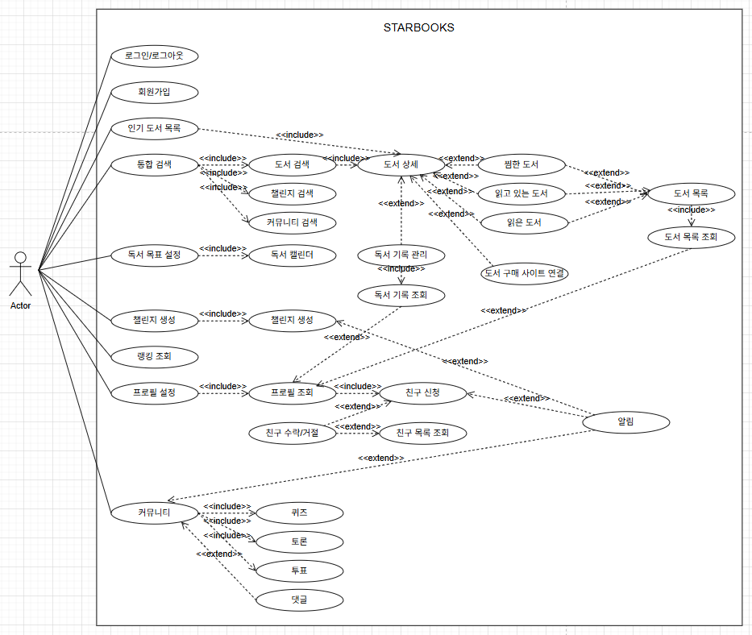

### 2.2. Use case Description

| Use case #1 | Register |
|:---|:---|
| **GENERAL CHARACTERISTICS** |  |
| Summary | 사용자가 시스템의 이용자가 되기 위한 절차이며 모든 사용자는 사용에 앞서 회원가입을 해야 한다. |
| Scope | Starbooks |
| Level | User level |
| Author | |
| Last Update | 2025/12/06 |
| Status | Analysis |
| Primary Actor | Actor |
| Preconditions | 사용자는 웹 서비스에 접속한 상태여야 한다. |
| Trigger | 사용자가 첫 화면에서 회원가입 버튼을 클릭할 때 |
| Success Post Condition | 등록한 정보로 로그인할 수 있다. |
| Failed Post Condition | 회원가입이 완료되지 않으며, 사용자는 서비스를 이용할 수 없다. |
| **MAIN SUCCESS SCENARIO** |  |
| Step |Action|
| S | 사용자가 회원가입을 한다. |
| 1 | 사용자는 첫 화면에서 회원가입 버튼을 클릭한다. |
| 2 | 시스템은 회원가입 화면을 표시한다. |
| 3 | 사용자는 이름, 이메일, 비밀번호, 비밀번호 확인, 닉네임을 입력 후 회원가입 버튼을 누른다. |
| 4 | 시스템은 입력한 정보의 유효성을 검사한다. |
| 5 | 시스템은 이메일과 닉네임의 중복 확인을 검사한다. |
| 6 | 모든 정보가 유효하고 중복이 없다면, 시스템은 회원 정보를 저장하고 회원가입을 완료한다. |
| 7 | 시스템은 완료 메시지를 표시하고 로그인 화면으로 이동시킨다. |
| **EXTENSION SCENARIOS** ||
| Step | Branching Action |
| 4 | 4a. 입력값 유효성 실패|
|   | ...4a1. 사용자가 입력 칸을 비워두었거나 형식이 잘못된 경우, 중복 확인을 하지 않은 경우 오류 메시지를 표시한다.|
| 5 | 5a. 이메일 또는 닉네임 중복 |
|   | ...5a1. "이미 사용중인 이메일" 메시지를 표시하고 다른 이메일 입력을 요구한다.|
|   | ...5a2. "중복된 닉네임" 메시지를 표시하고 다른 닉네임 입력을 요구한다. |
| **RELATED INFORMATION** ||
| Performance | ≤ 1 second |
| Frequency | 사용자당 1번 |
| < Concurrency > | 제한 없음 |
| Due Date | |

| Use case #2 | Login/Logout |
|:---|:---|
| **GENERAL CHARACTERISTICS** |  |
| Summary | 사용자가 서비스에 이용하기 위하여 로그인하고, 이용 종료를 위한 로그아웃 과정이다. 로그인을 완료한 사용자는 모든 서비스를 이용할 수 있다. |
| Scope | Starbooks |
| Level | User level |
| Author | |
| Last Update | 2025/12/06 |
| Status | Analysis |
| Primary Actor | User |
| Preconditions | 사용자는 이미 회원가입을 완료한 상태여야 한다. |
| Trigger | 사용자가 로그인 화면에서 로그인 버튼을 클릭할 때, 로그인된 상태에서 로그아웃 버튼을 클릭할 때 |
| Success Post Condition | 로그인: 사용자가 서비스 기능을 이용할 수 있다. / 로그아웃: 로그아웃이 완료되고 인트로 화면으로 돌아간다. |
| Failed Post Condition | 로그인 실패 시 서비스에 접근할 수 없다. / 로그아웃에 실패한다.|
| **MAIN SUCCESS SCENARIO** |  |
| Step |Action|
| S | 사용자가 서비스 이용을 위해 로그인하려 한다. |
| 1 | 사용자는 로그인 화면에서 이메일과 비밀번호를 입력한 후 로그인 버튼을 누른다. |
| 2 | 시스템은 사용자 정보를 체크하여 로그인 성공 유무를 판단한다. |
| 3 | 시스템은 등록된 사용자라면 로그인에 성공하고 홈 화면을 제공한다. |
| **EXTENSION SCENARIOS** ||
| Step | Branching Action |
| 1 | 1a. 인증 실패 |
|   | ...1a1. 시스템은 "이메일 또는 비밀번호가 올바르지 않습니다."라는 오류 메시지를 출력한다. |
| 3 | 3a. 로그아웃 |
|   | ...3a1. 사용자는 상단 메뉴에서 로그아웃 버튼을 클릭한다. |
|   | ...3a2. 시스템은 사용자를 로그아웃 시키고 인트로 화면으로 이동시킨다. |
| **RELATED INFORMATION** ||
| Performance | ≤ 1 second |
| Frequency | 사용자당 1번 |
| < Concurrency > | 제한 없음 |
| Due Date | |

| Use case #3 | Manage Reading Goal |
|:---|:---|
| **GENERAL CHARACTERISTICS** |  |
| Summary | 사용자가 자신의 일일 독서 목표를 페이지 단위로 설정하고 조회하며 수정하는 기능이다. 목표 진행률도 확인할 수 있다. |
| Scope | Starbooks |
| Level | User Level |
| Author | |
| Last Update | 2025/12/06 |
| Status | Analysis |
| Primary Actor | User |
| Preconditions | 사용자는 로그인한 상태여야 한다. |
| Trigger | 사용자가 내 서재에서 독서 목표 설정 버튼을 선택했을 때 |
| Success Post Condition | 사용자의 독서 목표가 정상적으로 설정, 수정 또는 조회된다. |
| Failed Post Condition | 목표 설정 또는 수정 실패한다. |
| **MAIN SUCCESS SCENARIO** |  |
| Step |Action|
| S | 사용자는 자신의 독서 목표를 설정하거나 확인하려 한다. |
| 1 | 사용자는 내 서재 페이지로 이동한다. |
| 2 | 시스템은 현재 설정된 목표를 불러와 화면에 표시한다. |
| 3 | 사용자는 목표 설정 버튼을 클릭하여 목표를 수정하거나, 설정된 목표에 대한 현재 진행상태를 업데이트한다. |
| 4 | 시스템은 입력된 목표 정보 및 현재 진행상태를 저장한다. |
| 5 | 시스템은 목표 진행률을 갱신하여 사용자에게 표시한다. |
| **EXTENSION SCENARIOS** ||
| Step | Branching Action |
| 2 | 2a. 목표 데이터 없음 |
|   | ...2a1. 시스템은 “설정된 목표가 없습니다.”를 표시하고 목표 입력을 권유하는 메시지를 표시한다. |
| **RELATED INFORMATION** ||
| Performance | ≤ 1 second |
| Frequency | 필요 시 |
| < Concurrency > | 제한 없음 |
| Due Date | |

| Use case #4 | Reading Calendar |
|:---|:---|
| **GENERAL CHARACTERISTICS** |  |
| Summary | 사용자가 독서 캘린더를 통해 자신이 설정한 목표에 달성한 날짜를 시각적으로 확인할 수 있다. |
| Scope | Starbooks |
| Level | User Level |
| Author | |
| Last Update | 2025/12/06 |
| Status | Analysis |
| Primary Actor | User |
| Preconditions | 사용자는 로그인 상태여야 한다. 설정한 독서 목표가 있어야 한다. |
| Trigger | 사용자가 홈 화면 또는 내 서재 페이지로 이동하였을 때 |
| Success Post Condition | 목표 달성일이 성공적으로 캘린더에 표시된다. |
| Failed Post Condition | 목표 달성일이 캘린더에 표시되지 못한다. |
| **MAIN SUCCESS SCENARIO** |  |
| Step |Action|
| S | 사용자는 독서 캘린더에서 자신의 목표 달성일을 확인려 한다. |
| 1 | 사용자는 홈 화면 또는 내 서재 페이지로 이동한. |
| 2 | 시스템은 독서 캘린더 영역에 목표 달성일을 표시한다.|
| **EXTENSION SCENARIOS** ||
| Step | Branching Action |
| | |
| **RELATED INFORMATION** ||
| Performance | ≤ 1 second|
| Frequency | 제한 없음 |
| < Concurrency > | 제한 없음 |
| Due Date | |

| Use case #5 | Integrated search |
|:---|:---|
| **GENERAL CHARACTERISTICS** |  |
| Summary | 사용자가 서비스 내 다양한 정보를 통합 검색하는 기능이다. 검색 대상에는 도서, 챌린지, 커뮤니티 글 항목들로 포함한다. |
| Scope | Starbooks |
| Level | User Level |
| Author | |
| Last Update | 2025/12/06 |
| Status | Analysis |
| Primary Actor | User |
| Preconditions | 사용자는 로그인 상태여야 한다. |
| Trigger | 사용자가 상단 돋보기 검색 영역에서 검색창에 키워드를 입력하여 엔터를 입력하였을 때 |
| Success Post Condition | 연관된 검색 결과가 정상적으로 사용자에게 표시된다. |
| Failed Post Condition | 검색 결과가 잘못 표시되거나 오류 메시지를 출력한다. |
| **MAIN SUCCESS SCENARIO** |  |
| Step |Action|
| S | 사용자가 원하는 정보를 찾기 위해 통합 검색을 수행하려 한다. |
| 1 | 사용자는 검색창에 검색 키워드를 입력하여 엔터를 입력한다. |
| 2 | 시스템은 입력된 키워드를 기반으로 도서, 챌린지, 커뮤니티 범위에서 검색을 수행한다. |
| 3 | 시스템은 검색 결과를 사용자에게 표시한다. |
| 4 | 사용자는 원하는 결과를 선택하여 상세 페이지로 이동한다. |
| **EXTENSION SCENARIOS** ||
| Step | Branching Action |
| 3 | 3a. 검색 결과 없음 |
|   |...3a1. 시스템은 "검색 결과가 없습니다." 메시지를 표시한다. |
| **RELATED INFORMATION** ||
| Performance | ≤ 5 seconds |
| Frequency | 필요 시 |
| < Concurrency > | 제한 없음 |
| Due Date | |

| Use case #6 | Search Book Information |
|:---|:---|
| **GENERAL CHARACTERISTICS** |  |
| Summary | 사용자가 도서 정보 페이지에서 원하는 도서를 검색하기 위해 키워드를 입력하고 검색 결과 목록을 확인하며, 원하는 도서를 선택하여 상세 정보를 조회하는 기능이다. |
| Scope | Starbooks |
| Level | User Level |
| Author | |
| Last Update | 2025/12/06 |
| Status | Analysis |
| Primary Actor | User |
| Preconditions | 사용자는 로그인 상태여야 한다. 시스템은 외부 API 연동을 유지하고 있어야 한다.|
| Trigger | 사용자가 도서 정보 페이지로 이동하여 검색창에 키워드를 입력했을 때 |
| Success Post Condition | 해당 검색 키워드와 일치하는 도서 목록이 사용자에게 정상적으로 표시된다. |
| Failed Post Condition | 검색 오류 발생 시 시스템은 “검색 결과가 없습니다.” 또는 오류 메시지를 출력한다. |
| **MAIN SUCCESS SCENARIO** |  |
| Step |Action|
| S | 사용자는 원하는 도서를 찾기 위해 도서 검색 기능을 사용하려 한다. |
| 1 | 사용자는 도서 정보 페이지의 검색창에 도서명, 저자명 등 검색어를 입력한다. |
| 2 | 시스템은 입력된 검색어를 기반으로 도서 데이터를 조회하고, 검색 결과로 일치하는 도서 목록을 출력한다. |
| 3 | 사용자는 검색 결과 목록 중 원하는 도서를 선택한다. |
| 4 | 시스템은 선택된 도서의 상세 페이지로 이동시킨다. |
| **EXTENSION SCENARIOS** ||
| Step | Branching Action |
| 1 | 1a. 검색어 입력 전 |
|   | ...1a1. 인기 도서 목록을 보여준다. |
| **RELATED INFORMATION** ||
| Performance | ≤ 10 seconds |
| Frequency | 필요 시 |
| < Concurrency > | 제한 없음|
| Due Date | |

| Use case #7 | View Popular Books |
|:---|:---|
| **GENERAL CHARACTERISTICS** |  |
| Summary | 사용자가 시스템이 제공하는 인기 도서 목록을 확인하고, 해당 도서 상세 정보를 조회하는 기능이다. 인기 도서는 외부 API를 통해 최신 상태로 유지된다. |
| Scope | Starbooks |
| Level | User Level |
| Author | |
| Last Update | 2025/12/06 |
| Status | Analysis |
| Primary Actor | User |
| Preconditions | 사용자는 로그인 상태여야 한다. 시스템은 외부 API 연동된 상태여야 한다. |
| Trigger | 사용자가 홈 화면 또는 도서 정보 페이지로 이동하였을 때 |
| Success Post Condition | 인기 도서 목록이 사용자에게 정상적으로 표시된다. |
| Failed Post Condition | 오류 발생 시 인기 도서 목록이 표시되지 않는다. |
| **MAIN SUCCESS SCENARIO** |  |
| Step |Action|
| S | 사용자는 현재 인기 있는 도서를 확인하기를 원한다. |
| 1 | 사용자는 홈 화면 또는 도서 정보 페이지에서 인기 도서 영역을 확인한다. |
| 2 | 시스템은 외부 API에서 수집된 인기 도서 데이터를 기반으로 정렬된 목록을 사용자에게 보여준다. |
| **EXTENSION SCENARIOS** ||
| Step | Branching Action |
| | |
| **RELATED INFORMATION** ||
| Performance | ≤ 10 seconds |
| Frequency | 제한 없음 |
| < Concurrency > | 제한 없음 |
| Due Date | |

| Use case #8 | View Book Details |
|:---|:---|
| **GENERAL CHARACTERISTICS** |  |
| Summary | 사용자가 특정 도서를 선택했을 때, 해당 도서의 상세 정보(제목, 저자, 출판사, 책 소개)를 조회하는 기능이다. |
| Scope | Starbooks |
| Level | User Level |
| Author | |
| Last Update | 2025/12/06 |
| Status | Analysis |
| Primary Actor | User |
| Preconditions | 사용자는 로그인 상태여야 한다. |
| Trigger | 사용자가 특정 도서를 클릭했을 때 |
| Success Post Condition | 도서 상세 정보가 화면에 정상적으로 표시된다. |
| Failed Post Condition | 도서 정보를 불러올 수 없어 정보를 확인할 수 없다. |
| **MAIN SUCCESS SCENARIO** |  |
| Step |Action|
| S | 사용자는 선택한 도서에 대한 상세 정보를 확인하려 한다. |
| 1 | 사용자는 도서 목록 등에서 특정 도서를 클릭한다. |
| 2 | 시스템은 해당 도서의 상세 데이터를 불러와 사용자에게 제목, 저자, 출판사, 표지, 책 소개 정보를 표시한다. |
| **EXTENSION SCENARIOS** ||
| Step | Branching Action |
| | |
| **RELATED INFORMATION** ||
| Performance | ≤ 2 seconds |
| Frequency | 필요 시 |
| < Concurrency > | 제한 없음 |
| Due Date | |

| Use case #9 | Manage Book List |
|:---|:---|
| **GENERAL CHARACTERISTICS** |  |
| Summary | 사용자가 내 서재에서 자신의 도서 목록을 조회하고, 목록에 도서를 추가하거나 찜하기 기능을 통해 관심 도서를 관리하는 기능이다. 이 기능은 View Book Details에서 제공하는 버튼을 통해 관리되어 내 서재 페이지에서 조회가 가능하다. |
| Scope | Starbooks |
| Level | User Level |
| Author | |
| Last Update | 2025/12/06 |
| Status | Analysis |
| Primary Actor | User |
| Preconditions | 사용자는 로그인된 상태여야 한다. |
| Trigger | 사용자가 내 서재 페이지로 이동하였을 때, 도서 상세 페이지에서 찜하기와 추가하기 버튼을 선택했을 때 |
| Success Post Condition | 사용자의 도서 목록이 정상적으로 불러와지고, 수정사이 반영된다. |
| Failed Post Condition | 도서 목록을 정상적으로 표시할 수 없다. |
| **MAIN SUCCESS SCENARIO** |  |
| Step |Action|
| S | 사용자는 자신의 도서 목록을 조회하거나 관리하려 한다. |
| 1 | 사용자는 내 서재 페이지로 이동한다. |
| 2 | 시스템은 사용자의 도서 목록 데이터를 불러와 카테고리(읽고 있는 도서, 읽은 도서, 찜한 도서)에 맞게 화면에 표시한다. |
| 3 | 사용자는 목록에서 도서를 확인하고, 필요 시 상세 페이지로 이동하여 도서를 추가하거나 찜하기를 선택한다. |
| 4 | 시스템은 선택한 도서를 사용자 도서 목록에 반영한다. |
| **EXTENSION SCENARIOS** ||
| Step | Branching Action |
| | |
| **RELATED INFORMATION** ||
| Performance | ≤ 2 seconds |
| Frequency | 필요 시 |
| < Concurrency > | 제한 없음 |
| Due Date | |

| Use case #10 | Manage Reading Progress |
|:---|:---|
| **GENERAL CHARACTERISTICS** |  |
| Summary | 사용자가 특정 도서의 진행률을 설정하거나 수정하여 자신의 독서 진행 상황을 관리하는 기능이다. |
| Scope | Starbooks |
| Level | User Level |
| Author | |
| Last Update | 2025/12/06 |
| Status | Analysis |
| Primary Actor | User |
| Preconditions | 사용자는 로그인 상태여야 한다. 사용자는 자신의 서재에 해당 도서를 이미 추가한 상태여야 한다. |
| Trigger | 사용자가 도서 상세 페이지에서 진행률 수정 버튼을 선택했을 때 |
| Success Post Condition | 도서 진행률이 정상적으로 저장되고, 진행률 그래프에 즉시 반영된다. |
| Failed Post Condition | 진행률 값이 저장되지 않는다. |
| **MAIN SUCCESS SCENARIO** |  |
| Step |Action|
| S | 사용자는 선택한 도서의 독서 진행률을 설정하거나 수정하려 한다. |
| 1 | 사용자는 진행률 수정 버튼을 누른다. |
| 2 | 사용자는 전체 페이지 수와 진행 페이지 수를 입력한다. |
| 3 | 시스템은 진행률 데이터를 저장한 뒤 업데이트된 진행률을 화면에 표시한다. |
| **EXTENSION SCENARIOS** ||
| Step | Branching Action |
| 2 | 2a. 진행률 설정 전|
|   | ...2a1. "아직 진행률이 설정되지 않았습니다. 진행률 설정으로 나의 도서 진행률을 확인해보세요!" 메시지를 표시한다. |
| **RELATED INFORMATION** ||
| Performance | ≤ 1 second |
| Frequency | 필요 시|
| < Concurrency > | 제한 없 |
| Due Date | |

| Use case #11 | Manage Reading Records |
|:---|:---|
| **GENERAL CHARACTERISTICS** |  |
| Summary | 사용자가 특정 도서에 대해 독서 기록(도서평, 별점, 좋아하는 구절)을 작성하고 삭제하는 기능이다. |
| Scope | Starbooks |
| Level | User Level |
| Author | |
| Last Update | 2025/12/06 |
| Status | Analysis |
| Primary Actor | User |
| Preconditions | 사용자는 로그인 상태여야 한다. 사용자는 해당 도서를 자신의 서재에 보유하고 있어야 한다. |
| Trigger | 사용자가 도서 상세 페이지에서 독서 기록 작성 버튼을 누를 때, 독서 기록의 삭제 버튼을 누를 때|
| Success Post Condition | 독서 기록이 정상적으로 작성, 삭제된다. |
| Failed Post Condition | 독서 기록이 저장되지 않거나 삭제되지 않는다. |
| **MAIN SUCCESS SCENARIO** |  |
| Step |Action|
| S | 사용자는 특정 도서에 대한 독서 기록을 작성하거나 관리하려 한다. |
| 1 | 사용자는 도서 상세 페이지에서 독서 기록 작성 버튼을 선택한다. 삭제를 원할 경우 삭제 버튼을 누른다. |
| 2 | 사용자는 도서평, 별점, 좋아하는 구절을 입력하고 작성하기 버튼을 누른다. |
| 3 | 시스템은 기록 정보를 검증하고 저장한다. |
| 4 | 저장한 기록이 관련 페이지에 즉시 갱신되어 표시된다. |
| **EXTENSION SCENARIOS** ||
| Step | Branching Action |
| | |
| **RELATED INFORMATION** ||
| Performance | ≤ 1 second |
| Frequency | 제한 없 |
| < Concurrency > | 제한 없음|
| Due Date | |

| Use case #12 | View Ratings & Reviews |
|:---|:---|
| **GENERAL CHARACTERISTICS** |  |
| Summary | 사용자가 특정 도서에 대해 다른 사용자들이 남긴 독서 기록을 조회하는 기능이다. |
| Scope | Starbooks |
| Level | User Level |
| Author | |
| Last Update | 2025/12/06 |
| Status | Analysis |
| Primary Actor | User |
| Preconditions | 사용자는 로그인 상태여야 한다. |
| Trigger | 사용자가 도서 상세 페이지에서 사용자 도서평 영역을 확인할 때 |
| Success Post Condition | 사용자에게 해당 도서의 도서평 목록이 상적으로 표시된다.|
| Failed Post Condition | 도서평을 조회할 수 없다. |
| **MAIN SUCCESS SCENARIO** |  |
| Step |Action|
| S | 사용자는 특정 도서에 대한 다른 사용자들의 도서를 확인하려 한다. |
| 1 | 사용자는 도서 상세 페이지에서 도서평 영역으로 이동한다. |
| 2 | 시스템은 해당 도서에 등록된 도서평 데이터를 조회하고 사용자에게 표시한다. |
| **EXTENSION SCENARIOS** ||
| Step | Branching Action |
| | |
| **RELATED INFORMATION** ||
| Performance | ≤ 2 seconds |
| Frequency | 필요 시 |
| < Concurrency > | 제한 없음 |
| Due Date | |

| Use case #13 | Go to Purchase Page |
|:---|:---|
| **GENERAL CHARACTERISTICS** |  |
| Summary | 사용자가 도서 상세 페이지에서 제공되는 구매하러 가기 버튼을 클릭하여 외부 서점 사이트로 이동하는 기능이다.|
| Scope | Starbooks |
| Level | User Level |
| Author | |
| Last Update | |
| Status | Analysis |
| Primary Actor | User |
| Preconditions | 사용자는 로그인 상태여야 한다. |
| Trigger | 사용자가 도서 상세 페이지에서 구매하러 가기 버튼을 클릭할 때 |
| Success Post Condition | 사용자는 해당 도서 제목으로 검색된 외부 서점의 도서 구매 페이지로 정상적으로 이동한다. |
| Failed Post Condition | 외부 사이트에 접속하지 못한다. |
| **MAIN SUCCESS SCENARIO** |  |
| Step |Action|
| S | 사용자는 해당 도서를 구매하기 위해 구매 페이지로 이동하려 한다. |
| 1 | 사용자는 도서 상세 페이지에서 구매하러 가기 버튼을 클릭하여 원하는 외부 서점 사이트를 선택한다. |
| 2 | 시스템은 도서에 연결된 외부 서점 링크를 확인하고 사용자를 해당 링크로 이동시킨다. |
| 3 | 사용자는 해당 도서로 검색된 외부 사이트에서 구매 절차를 진행할 수 있다. |
| **EXTENSION SCENARIOS** ||
| Step | Branching Action |
| | |
| **RELATED INFORMATION** ||
| Performance | ≤ 5 seconds |
| Frequency | 필요 시 |
| < Concurrency > | 제한 없음 |
| Due Date | |

| Use case #14 | Create Challenge |
|:---|:---|
| **GENERAL CHARACTERISTICS** |  |
| Summary | 사용자가 새로운 독서 챌린지를 생성하는 기능이다. |
| Scope | Starbooks |
| Level | User Level |
| Author | |
| Last Update | 2025/12/06 |
| Status | Analysis |
| Primary Actor | User |
| Preconditions | 사용자는 로그인된 상태여야 한다. |
| Trigger | 사용자가 챌린지 페이지에서 챌린지 생성 버튼을 클릭할 때 |
| Success Post Condition | 새로운 챌린지가 정상적으로 생성되고 챌린지 목록에 표시된다. |
| Failed Post Condition | 챌린지가 생성할 수 다. |
| **MAIN SUCCESS SCENARIO** |  |
| Step |Action|
| S | 사용자는 새로운 독서 챌린지를 만들고자 한다. |
| 1 | 사용자는 챌린지 생성 버튼을 클릭한다. |
| 2 | 시스템은 챌린지 생성 양식(챌린지 제목, 내용, 마감일, 목표권수)을 사용자에게 보여준다. |
| 3 | 사용자는 입력한 내용을 확인한 후 생성하기 버튼을 선택한다. |
| 4 | 시스템은 챌린지를 생성하고 챌린지 목록을 갱신한다.|
| **EXTENSION SCENARIOS** ||
| Step | Branching Action |
| 3 | 3a. 입력 정보 누락 |
|   | ...3a1. 시스템은 "정보를 모두 입력해주세요" 메시지를 표시하고 입력을 요청한다. |
| **RELATED INFORMATION** ||
| Performance | ≤ 2 seconds |
| Frequency | 필요 시 |
| < Concurrency > | 제한 없|
| Due Date | |

| Use case #15 | Participate/Cancel Challenge |
|:---|:---|
| **GENERAL CHARACTERISTICS** |  |
| Summary | 사용자가 특정 독서 챌린지에 참여하거나 이미 참여한 챌린지를 취소하는 기능이다. |
| Scope | Starbooks |
| Level | User Level |
| Author | |
| Last Update | 2025/12/06 |
| Status | Analysis |
| Primary Actor | User |
| Preconditions | 사용자는 로그인되어 있어야 한다. |
| Trigger | 사용자가 챌린지 페이지에서 참여하기 버튼을 클릭했을 때, 참여 취소 버튼을 클릭했을 때 |
| Success Post Condition | 참여하기: 사용자가 챌린지 참여자로 등록된다. / 참여취소: 사용자의 챌린지 참여 기록이 삭제된다. |
| Failed Post Condition | 참여/취소가 정상적으로 처리되지 않는.|
| **MAIN SUCCESS SCENARIO** |  |
| Step |Action|
| S | 사용자는 특정 챌린지에 참여하거나 취소하고자 한다. |
| 1 | 사용자는 챌린지 페이지에서 참여하기 버튼을 클릭한다. |
| 2 | 시스템은 사용자의 기존 참여 여부를 확인하고 사용자 참여 기록을 추가한다. |
| 3 | 사용자는 참여중인 챌린지 목록에서 자신이 참여한 챌린지 목록을 확인할 수 있다. |
| 4 | 사용자가 참여중인 챌린지 목록에서 참여 취소 버튼을 클릭한다. |
| 5 | 시스템은 사용자의 참여 상태를 확인하고 사용자 참여 기록을 삭제한다. |
| **EXTENSION SCENARIOS** ||
| Step | Branching Action |
| | |
| **RELATED INFORMATION** ||
| Performance | ≤ 2 seconds|
| Frequency | 필요 시 |
| < Concurrency > | 제한 없음 |
| Due Date | |

| Use case #16 | View Rankings |
|:---|:---|
| **GENERAL CHARACTERISTICS** |  |
| Summary | 사용자가 전체 서비스 내의 다독 순위 및 챌린지 인기 순위를 조회하는 기능이다. |
| Scope | Starbooks |
| Level | User Level |
| Author | |
| Last Update | 2025/12/06 |
| Status | Analysis |
| Primary Actor | User |
| Preconditions | 사용자는 로그인된 상태여야 한다. |
| Trigger | 사용자가 랭킹 페이지를 선택할 때 |
| Success Post Condition | 사용자는 랭킹 정보를 정상적으로 확인한다. |
| Failed Post Condition | 랭킹 정보를 불러오지 못한다. |
| **MAIN SUCCESS SCENARIO** |  |
| Step |Action|
| S | 사용자는 전체 서비스 내 다독 순위 및 챌린지 인기 순위를 조회하고, 자신의 다독순위를 조회하려 한다. |
| 1 | 사용자는 랭킹 페이지로 이동한다. |
| 2 | 시스템은 랭킹 데이터 받아와 화면에 표시한. |
| 3 | 사용자는 자신의 순위 및 다른 사용자들의 순위, 챌린지 인기 순위를 확인할 수 있다.|
| **EXTENSION SCENARIOS** ||
| Step | Branching Action |
| | |
| **RELATED INFORMATION** ||
| Performance | ≤ 2 seconds|
| Frequency | 제한 없음 |
| < Concurrency > | 제한 없음 |
| Due Date | |

| Use case #17 | Manage Posts/Comments |
|:---|:---|
| **GENERAL CHARACTERISTICS** |  |
| Summary | 사용자가 커뮤니티 글을 작성하거나 삭제할 수 있으며, 글에 대해 댓글을 작성할 수 있다. |
| Scope | Starbooks |
| Level | User Level |
| Author | |
| Last Update | 2025/12/06 |
| Status | Analysis |
| Primary Actor | User |
| Preconditions | 사용자는 로그인된 상태여야 한다. 글 삭제의 경우, 사용자가 해당 글의 작성자여야 한다. 댓글의 경우, 작성된 글이 존재해야 한다. |
| Trigger | 사용자가 커뮤니티 화면에서 작성하기 버튼을 선택할 때, 자신이 작성한 글에 대해 삭제 버튼을 클릭할 때, 댓글 작성 버튼을 클릭할 때|
| Success Post Condition | 게시글이 성공적으로 작성되어 커뮤니티 목록에 표시된다. 게시글이 정상적으로 삭제된다. 댓글이 정상적으로 등록된다. |
| Failed Post Condition | 게시글 작성 또는 삭제가 이루어지지 않는다. 댓글이 등록되지 않는다. |
| **MAIN SUCCESS SCENARIO** |  |
| Step |Action|
| S | 사용자는 커뮤니티에 글을 작성하거나 기존 글을 삭제하려 한다. |
| 1 | 사용자는 커뮤니티 화면으로 이동하여 글 작성 버튼을 클릭한다. |
| 2 | 사용자는 원하는 커뮤니티 양식(퀴즈/투표/토론)에 따라 제목, 내용을 입력한 후 작성하기 버튼을 누른다.|
| 3 | 시스템은 게시글의 유효성을 검사하고 저장 후 커뮤니티 목록에 반영한다. |
| 4 | 사용자는 업데이트된 커뮤니티 목록을 볼 수 있으며, 해당 커뮤니티 글에 대해 상세 화면으로 이동할 수 있다.
| 5 | 사용자는 댓글 등록 버튼을 클릭하여 댓글을 작성한다. |
| 6 | 시스템은 작성된 댓글을 등록하여 글 상세 페이지에 표시한다. |
| **EXTENSION SCENARIOS** ||
| Step | Branching Action |
| 4 | 4a. 글 삭제 |
|   | ...4a1. 사용자는 자신이 작성한 글에 대해 삭제 버튼을 클릭한다. |
|   | ...4a2. 시스템은 삭제 여부를 확인하는 메시지를 표시하고, 확정되면 게시글을 삭제하고 목록을 갱신한다. |
| **RELATED INFORMATION** ||
| Performance | ≤ 1 second |
| Frequency | 사용자당 하루 0~30회, 필요 시 |
| < Concurrency > | 제한 없음 |
| Due Date | |

| Use case #18 | Manage Notifications |
|:---|:---|
| **GENERAL CHARACTERISTICS** |  |
| Summary | 사용자가 서비스에서 제공하는 알림을 확인하는 기능이다. 알림에는 친구 요청, 댓글 알림, 챌린지 알림 등이 포함된다. |
| Scope | Starbooks |
| Level | User Level |
| Author | |
| Last Update | 2025/12/06 |
| Status | Analysis |
| Primary Actor | User |
| Preconditions | 사용자는 로그인된 상태여야 한다. |
| Trigger | 사용자가 상단의 알림 페이지를 클릭할 때 |
| Success Post Condition | 사용자는 알림을 성공적으로 확인하거나 읽음 처리할 수 있다. |
| Failed Post Condition | 알림을 성공적으로 불러올 수 없다. |
| **MAIN SUCCESS SCENARIO** |  |
| Step |Action|
| S | 사용자는 알림을 조회하거나 읽음처하려 한다. |
| 1 | 사용자가 상단의 알림 페이지를 클릭한다. |
| 2 | 시스템은 사용자 계정에 해당하는 알림 목록을 불러온다. |
| 3 | 사용자는 알림 목록에서 새로운 알림들을 확인하고, 특정 알림을 선택하여 읽음 상태로 변경할 수 있다.|
| 4 | 이 Use Case는 알림이 정상적으로 조회/읽음처리할 수 있으면 종료된다. |
| **EXTENSION SCENARIOS** ||
| Step | Branching Action |
| | |
| **RELATED INFORMATION** ||
| Performance | ≤ 1 second|
| Frequency | 필요 시 |
| < Concurrency > | 제한 없음 |
| Due Date | |

| Use case #19 | Manage Profile |
|:---|:---|
| **GENERAL CHARACTERISTICS** |  |
| Summary | 사용자가 자신의 프로필을 조회하거나 수정하는 과정이다. 프로필에는 닉네임, 소개글 등 기본 정보가 포함되며 사용자는 이를 마이페이지에서 변경할 수 있다. 설정한 프로필을 다른 사용자가 조회할 수 있다. |
| Scope | Starbooks |
| Level | User Level |
| Author | |
| Last Update | 2025/12/06 |
| Status | Analysis |
| Primary Actor | User |
| Preconditions | 사용자는 로그인한 상태여야 한다. |
| Trigger | 사용자가 마이페이지에서 프로필 설을 클릭했을 때 |
| Success Post Condition | 프로필 정보가 변경되거나 최신 상태로 표시된다. |
| Failed Post Condition | 프로필 수정이 실패하면 기존 정보가 유지된다. |
| **MAIN SUCCESS SCENARIO** |  |
| Step |Action|
| S | 사용자가 자신의 프로필을 확인하거나 수정하려 한다. |
| 1 | 사용자는 마이페이지에서 프로필 설정 페이지로 이동한다. |
| 2 | 시스템은 프로필 정보(닉네임, 소개글 등)를 화면에 표시한다. |
| 3 | 사용자는 기존 정보에서 수정하기를 원하는 항목을 변경한 후 수정 버튼을 누른다. |
| 4 | 시스템은 변경된 프로필 정보를 DB에 반영하고 성공 메시지를 보여준다. |
| 5 | 사용자는 업데이트된 프로필을 확인할 수 있다. |
| **EXTENSION SCENARIOS** ||
| Step | Branching Action |
| 3 | 3a. 닉네임 중복 |
|   | ...3a1. 시스템이 닉네임 중복을 감지하면 "이미 존재하는 닉네임" 메시지를 출력하고 재입력을 요구한다.|
| **RELATED INFORMATION** ||
| Performance | ≤ 1 second |
| Frequency | 사용자당 하루 5번 이하 |
| < Concurrency > | 제한 없음 |
| Due Date | |

| Use case #20 | Manage Friends |
|:---|:---|
| **GENERAL CHARACTERISTICS** |  |
| Summary | 사용자가 친구 목록을 확인하고, 다른 사용자를 검색하여 친구 추가 요청을 보내고 받은 친구 요청을 수락 혹은 거절하는 전반적인 친구 관리 과정이다. |
| Scope | Starbooks |
| Level | User Level |
| Author | |
| Last Update | 2025/12/06 |
| Status | Analysis|
| Primary Actor | User |
| Preconditions | 사용자는 로그인한 상태여야 한다. |
| Trigger | 사용자가 친구 서재에서 친구 신청 버튼을 클릭할 때, 사용자가 마이페이지의 친구 목록 페이지로 이동할 때, 친구 검색 버튼을 클릭할 때 |
| Success Post Condition | 친구 목록이 최신 상태로 업데이트 된다. 친구 요청이 정상적으로 처리된다. |
| Failed Post Condition | 친구 요청 또는 수락/거절이 반영되지 않는다. 검색 중 오류가 발생한다. |
| **MAIN SUCCESS SCENARIO** |  |
| Step |Action|
| S | 사용자가 친구 관리 기능을 이용하려 한다. |
| 1 | 사용자가 마이페이지에서 친구 목록을 클릭한다. |
| 2 | 시스템은 친구 수락 대기 목록과 현재 친구 목록을 함께 표시하고, 친구 검색 버튼을 제공한다. |
| 3 | 사용자는 친구 검색에서 다른 사용자 닉네임을 검색한다. |
| 4 | 시스템은 조건에 일치하는 사용자 목록을 보여준다. |
| 5 | 사용자는 원하는 사용자 프로필에서 친구 신청 버튼을 누른다. |
| 6 | 시스템은 친구 요청을 전송하고, 친구 수락 대기 목록에 추가한다. |
| 7 | 사용자는 친구 수락 대기 목록에서 요청을 확인하고, 수락 또는 거절 버튼을 누른다. |
| 8 | 시스템은 수락/거절 결과를 반영하여 친구 목록을 업데이트한다. |
| 9 | 업데이트된 친구 목록이 사용자에게 다시 표시된다. |
| **EXTENSION SCENARIOS** ||
| Step | Branching Action |
| 7 | 7a. 요청 수락 |
|   | ...7a1. 시스템은 양쪽 사용자 계정에 친구 관계를 생성한다. |
|   | 7b. 요청 거절 |
|   | ...7b1. 시스템은 해당 요청을 삭제하고, 친구 수락 대기 목록에서 해당 요청을 삭제한다.
| **RELATED INFORMATION** ||
| Performance | ≤ 1 second |
| Frequency | 사용자당 하루 10번 이하 |
| < Concurrency > | 제한 없음 |
| Due Date | |

| Use case #21 | View Other User’s Library |
|:---|:---|
| **GENERAL CHARACTERISTICS** |  |
| Summary | 사용자가 다른 사용자의 서재를 열람하는 기능이다. 사용자는 다른 사용자의 프로필, 도서 목록, 독서 기록을 확인할 수 있으며, 친구 신청을 보낼 수도 있다. |
| Scope | Starbooks |
| Level | User Level |
| Author | |
| Last Update | 2025/12/06 |
| Status | Analysis |
| Primary Actor | User |
| Preconditions | 사용자는 로그인 상태여야 한다. |
| Trigger | 사용자가 친구 목록 등에서 다른 사용자의 프로필을 클릭할 때 |
| Success Post Condition | 사용자는 다른 사용자의 서재 정보를 정상적으로 열람한다. |
| Failed Post Condition | 대상 사용자의 서재를 열람할 수 없다. |
| **MAIN SUCCESS SCENARIO** |  |
| Step |Action|
| S | 사용자는 다른 사용자의 서재를 확인하려 한다. |
| 1 | 사용자는 친구 목록 등에서 특정 사용자를 클릭한다. |
| 2 | 시스템은 해당 사용자의 프로필과 서재 정보를 불러와 화면에 표시한다. |
| 3 | 사용자는 다른 사용자가 읽은 도서, 읽고 있는 도서, 찜한 도서, 독서 기록 등을 확인한다. |
| 4 | 사용자는 친구 요청을 전송할 수 있으며, 요청 후 상태가 실시간으로 반영된다. |
| **EXTENSION SCENARIOS** ||
| Step | Branching Action |
| | |
| **RELATED INFORMATION** ||
| Performance | ≤ 2 seconds |
| Frequency | 필요 시 |
| < Concurrency > | 제한 없음 |
| Due Date | |

---

## 3. Class Diagram

이 장에서는 다양한 관점에서 바라본 Class diagram과 각각에 대한 설명을 작성한다.

### 3.1. DB Class Diagram

#### 3.1.1. User & Books

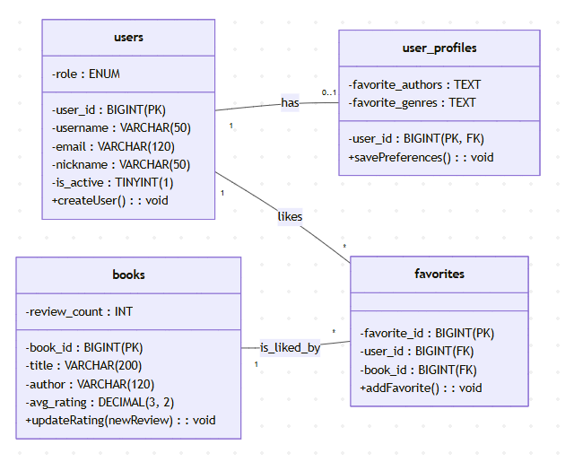

- users : 사용자 계정 및 기본 프로필 정보

| 구분 | Name | Type | Visibility | Description |
|:---|:---|:---|:---|:---|
| Attributes | user_id | BIGINT | private | 사용자 고유 식별자 (Primary Key) |
|            | username | VARCHAR(50) | private | 사용자 이름 |
|            | email | VARCHAR(120) | private | 사용자 이메일 주소 |
|            | password_hash | VARCHAR(255) | private | 암호화된 비밀번호 |
|            | nickname | VARCHAR(50) | private | 사용자가 활동 시 노출되는 별명 |
|            | role | ENUM('USER','ADMIN') | private | 사용자 권한 레벨 |
|            | profile_image | VARCHAR(255) | private | 프로필 이미지 |
|            | intro | VARCHAR(255) | private | 사용자 자기소개 문구 |
|            | is_active | TINYINT(1) | private | 계정 활성화 상태 |
|            | daily_page_goal | INT | private | 사용자가 설정한 하루 목표 독서 페이지 수 |
|            | created_at | DATETIME | private | 계정 생성 일시 |
|            | updated_at | DATETIME | private | 마지막 정보 수정 일시 |
| Operations | createUser() | void | public | 새 사용자 계정을 생성하고 저장 |
|            | updateProfile(userData) | void | public | 사용자 프로필 정보 업데이트 |

- user_profiles : 사용자 선호 정보 및 상세 프로필

| 구분 | Name | Type | Visibility | Description |
|:---|:---|:---|:---|:---|
| Attributes | user_id | BIGINT | private | 사용자 ID(PK, FK users) |
|            | favorite_authors | TEXT | private | 선호하는 작가 목록 |
|            | favorite_genres | TEXT | private | 선호하는 장르 목록 |
| Operations | savePreferences() | void | public | 선호 작가/장르 정보 저장 |

- books : 도서 기본 정보

| 구분 | Name | Type | Visibility | Description |
|:---|:---|:---|:---|:---|
| Attributes | book_id | BIGINT | private | 도서 고유 식별자 (PK) |
|            | title | VARCHAR(200) | private | 도서 제목 |
|            | author | VARCHAR(120) | private | 저자 이름 |
|            | publisher | VARCHAR(120) | private | 출판사 이름 |
|            | isbn | VARCHAR(20) | private | 국제 표준 도서 번호 (고유) |
|            | category | VARCHAR(80) | private | 도서 카테고리/장르 |
|            | description | TEXT | private | 도서 설명 |
|            | cover_image | VARCHAR(255) | private | 표지 이미지 |
|            | publish_date | DATE | private | 출판일 |
|            | avg_rating | DECIMAL(3, 2) | private | 평균 평점 |
|            | review_count | INT | private | 리뷰 수 |
|            | is_popular | TINYINT(1) | private | 인기도 여부 |
|            | created_at | DATETIME | private | 레코드 생성 일시 |
| Operations | updateRating(newReview) | void | public | 평점 및 리뷰 수 업데이트 |

- favorites : 사용자별 찜한 도서 목록

| 구분 | Name | Type | Visibility | Description |
|:---|:---|:---|:---|:---|
| Attributes | favorite_id | BIGINT | private | 찜하기 고유 식별자 (PK) |
|            | user_id | BIGINT | private | 사용자 ID (FK users) |
|            | book_id | BIGINT | private | 도서 ID (FK books) |
|            | created_at | DATETIME | private | 찜한 일시 |
| Operations | addFavorite() | void | public | 도서 찜하기 추가 |

#### 3.1.2. BookShelf & Reading Activity & Ranking

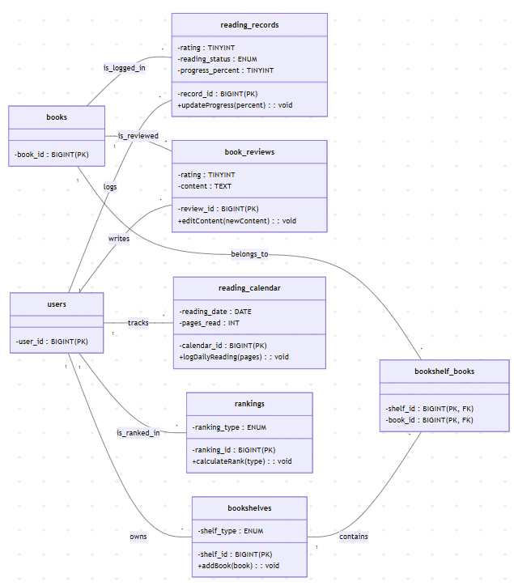

- bookshelves : 사용자별 서재 목록

| 구분 | Name | Type | Visibility | Description |
|:---|:---|:---|:---|:---|
| Attributes | shelf_id | BIGINT | private | 서재 고유 식별자 (PK) |
|            | user_id | BIGINT | private | 사용자 ID (FK users) |
|            | shelf_type | ENUM('READING','FINISHED','WISHLIST') | private | 서재 유형 |
|            | created_at | DATETIME | private | 서재 생성 일시 |
| Operations | addBook(book) | void | public | 서재에 도서 추가 |

- bookshelf_books : 서재에 속한 도서들

| 구분 | Name | Type | Visibility | Description |
|:---|:---|:---|:---|:---|
| Attributes | shelf_id | BIGINT | private | 서재 ID (PK, FK bookshelves) |
|            | book_id | BIGINT | private | 도서 ID (PK, FK books) |
|            | added_at | DATETIME | private | 서재에 추가된 일시 |
|            | created_at | DATETIME | private | 서재 생성 일시 |

- reading_records : 사용자의 독서 기록 상세

| 구분 | Name | Type | Visibility | Description |
|:---|:---|:---|:---|:---|
| Attributes | record_id | BIGINT | private | 독서 기록 고유 식별자 (PK) |
|            | user_id | BIGINT | private | 사용자 ID (FK users) |
|            | book_id | BIGINT | private | 도서 ID (FK books) |
|            | rating | TINYINT | private | 이 기록에서 남긴 평점 |
|            | review | TEXT | private | 이 기록에 남긴 리뷰 |
|            | favorite_quote | TEXT | private | 가장 인상 깊은 구절 |
|            | reading_status | ENUM('PLANNING','READING','FINISHED','PAUSED') | private | 현재 독서 상태 |
|            | progress_percent | TINYINT | private | 진행률 |
|            | start_date | DATE | private | 독서 시작일 |
|            | end_date | DATE | private | 독서 완료일 |
|            | created_at | DATETIME | private | 기록 생성 일시 |
|            | updated_at | DATETIME | private | 마지막 수정 일시 |
| Operations | updateProgress(percent) | void | public | 진행률 업데이트 및 상태 변경 |

- book_reviews : 도서에 대한 리뷰

| 구분 | Name | Type | Visibility | Description |
|:---|:---|:---|:---|:---|
| Attributes | review_id | BIGINT | private | 리뷰 고유 식별자 (PK) |
|            | user_id | BIGINT | private | 작성자 ID (FK users) |
|            | book_id | BIGINT | private | 도서 ID (FK books) |
|            | rating | TINYINT | private | 평점 (1~5점) |
|            | content | TEXT | private | 리뷰 내용 |
|            | created_at | DATETIME | private | 리뷰 작성 일시 |
|            | updated_at | DATETIME | private | 리뷰 수정 일시 |
| Operations | editContent(newContent) | void | public | 리뷰 내용 수정 |

- reading_calendar : 일일 독서량 및 목표 달성 현황

| 구분 | Name | Type | Visibility | Description |
|:---|:---|:---|:---|:---|
| Attributes | calendar_id | BIGINT | private | 캘린더 기록 고유 식별자 (PK) |
|            | user_id | BIGINT | private | 사용자 ID (FK users) |
|            | reading_date | DATE | private | 독서 기록 일자 |
|            | pages_read | INT | private | 해당 일 독서 페이지 수 |
|            | goal_achieved | TINYINT(1) | private | 일일 목표 달성 여부 |
|            | progress_note | VARCHAR(255) | private | 해당 일의 진행 메모 |
| Operations | logDailyReading(pages) | void | public | 일일 독서량 기록 |

- rankings : 사용자 랭킹 정보

| 구분 | Name | Type | Visibility | Description |
|:---|:---|:---|:---|:---|
| Attributes | ranking_id | BIGINT | private | 랭킹 고유 식별자 (PK) |
|            | user_id | BIGINT | private | 사용자 ID (FK users) |
|            | ranking_type | ENUM('BOOK_COUNT','GOAL_STREAK','CHALLENGE_WINS') | private | 랭킹 유형 |
|            | rank_position | INT | private | 현재 랭킹 순위 |
|            | value | INT | private | 랭킹 기준 값 |
|            | calculated_at | DATETIME | private | 랭킹 계산 일시 |
| Operations | calculateRank(type) | void | public | 랭킹 유형별 순위 계산 |

#### 3.1.3. Challenge & Community & Friend & Notifications

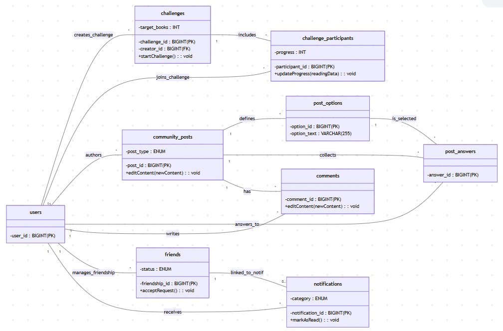

- challenges : 독서 챌린지 생성 정보

| 구분 | Name | Type | Visibility | Description |
|:---|:---|:---|:---|:---|
| Attributes | challenge_id | BIGINT | private | 챌린지 고유 식별자 (PK) |
|            | title | VARCHAR(120) | private | 챌린지 제목 |
|            | description | TEXT | private | 챌린지 설명 |
|            | target_books | INT | private | 목표 권수 |
|            | start_date | DATE | private | 챌린지 시작일 |
|            | end_date | DATE | private | 챌린지 종료일 |
|            | creator_id | BIGINT | private | 생성자 ID (FK users) |
|            | status | ENUM('SCHEDULED','ACTIVE','COMPLETED','CANCELLED') | private | 챌린지 상태 |
|            | created_at | DATETIME | private | 생성 일시 |
| Operations | startChallenge() | void | public | 챌린지 시작 상태로 변경 |
|            | checkProgress() | VARCHAR(255) | private | 참가자들의 진행 상황 확인 |

- challenge_participants : 챌린지 참가자 목록

| 구분 | Name | Type | Visibility | Description |
|:---|:---|:---|:---|:---|
| Attributes | participant_id | BIGINT | private | 참가 기록 고유 식별자 (PK) |
|            | challenge_id | BIGINT | private | 챌린지 ID (FK challenges) |
|            | user_id | BIGINT | private | 참가 사용자 ID (FK users) |
|            | progress | INT | private | 참가자의 현재 독서 진행률 |
|            | is_completed | TINYINT(1) | private | 챌린지 완료 여부 |
|            | joined_at | DATETIME | private | 챌린지 참가 일시 |
| Operations | updateProgress(readingData) | void | public | 독서 기록을 반영하여 진행률 업데이트 |

- community_posts : 커뮤니티 게시글 (퀴즈, 투표, 토론)

| 구분 | Name | Type | Visibility | Description |
|:---|:---|:---|:---|:---|
| Attributes | post_id | BIGINT | private | 게시글 고유 식별자 (PK) |
|            | user_id | BIGINT | private | 작성자 ID (FK users) |
|            | book_title | VARCHAR(200) | private | 관련 도서 제목 (직접 저장) |
|            | post_type | ENUM('QUIZ','POLL','DISCUSSION') | private | 게시글 유형 |
|            | title | VARCHAR(150) | private | 게시글 제목 |
|            | content | TEXT | private | 본문 내용 (QUIZ/POLL은 문제 질문) |
|            | created_at | DATETIME | private | 작성 일시 |
|            | updated_at | DATETIME | private | 수정 일시 |
| Operations | editContent(newContent) | void | public | 게시글 내용 수정 |

- post_options : 퀴즈/투표 선택지

| 구분 | Name | Type | Visibility | Description |
|:---|:---|:---|:---|:---|
| Attributes | option_id | BIGINT | private | 선택지 고유 식별자 (PK) |
|            | post_id | BIGINT | private | 게시글 ID (FK community_posts) |
|            | option_text | VARCHAR(255) | private | 선택지 내용 |
|            | is_correct | TINYINT(1) | private | 퀴즈 정답 여부 |
|            | option_order | INT | private | 선택지 순서 |

- post_answers : 사용자의 퀴즈/투표 응답

| 구분 | Name | Type | Visibility | Description |
|:---|:---|:---|:---|:---|
| Attributes | answer_id | BIGINT | private | 응답 고유 식별자 (PK) |
|            | post_id | BIGINT | private | 게시글 ID (FK community_posts) |
|            | user_id | BIGINT | private | 응답자 ID (FK users) |
|            | option_id | BIGINT | private | 선택한 선택지 ID (FK post_options) |
|            | answered_at | DATETIME | private | 응답 일시 |

- comments : 게시글 댓글

| 구분 | Name | Type | Visibility | Description |
|:---|:---|:---|:---|:---|
| Attributes | comment_id | BIGINT | private | 댓글 고유 식별자 (PK) |
|            | post_id | BIGINT | private | 게시글 ID (FK community_posts) |
|            | user_id | BIGINT | private | 작성자 ID (FK users) |
|            | content | TEXT | private | 댓글 내용 |
|            | created_at | DATETIME | private | 작성 일시 |
|            | updated_at | DATETIME | private | 수정 일시 |
| Operations | editContent(newContent) | void | public | 댓글 내용 수정 |

- friends : 친구 관계 요청 및 상태

| 구분 | Name | Type | Visibility | Description |
|:---|:---|:---|:---|:---|
| Attributes | friendship_id | BIGINT | private | 친구 관계 고유 식별자 (PK) |
|            | requester_id | BIGINT | private | 친구 요청자 ID (FK users) |
|            | receiver_id | BIGINT | private | 친구 수신자 ID (FK users) |
|            | status | ENUM('PENDING','ACCEPTED','REJECTED','BLOCKED') | private | 관계 상태 |
|            | created_at | DATETIME | private | 요청 생성 일시 |
| Operations | acceptRequest() | void | public | 친구 요청 수락 |

- notifications : 사용자 알림

| 구분 | Name | Type | Visibility | Description |
|:---|:---|:---|:---|:---|
| Attributes | notification_id | BIGINT | private | 알림 고유 식별자 (PK) |
|            | user_id | BIGINT | private | 알림 수신자 ID (FK users) |
|            | ref_friendship_id | BIGINT | private | 참조 친구 관계 ID (FK friends, 친구 요청 알림 시) |
|            | category | ENUM('SYSTEM','FRIEND','CHALLENGE','COMMUNITY') | private | 알림 유형 |
|            | message | VARCHAR(255) | private | 알림 내용 |
|            | is_read | TINYINT(1) | private | 알림 읽음 여부 |
|            | created_at | DATETIME | private | 알림 생성 일시 |
| Operations | markAsRead() | void | public | 알림을 읽음 상태로 변경 |

### 3.2. Domain Class Diagram

#### 3.2.1. User & Book Shelf & Reading Activity

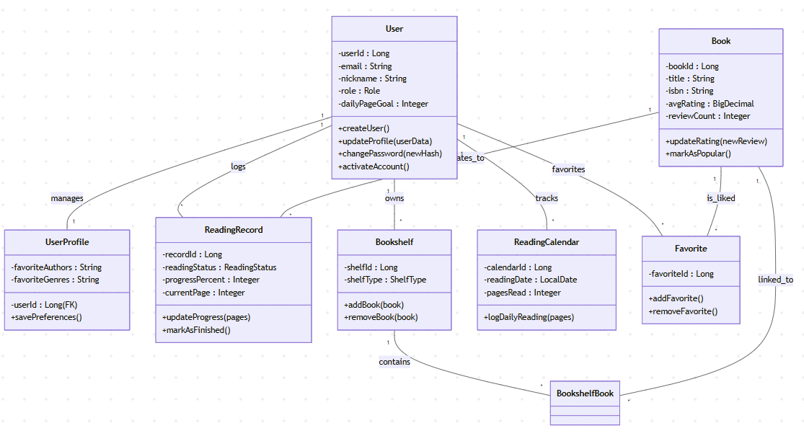

- User : 사용자 계정 및 기본 정보(인증, 식별)를 관리하는 핵심 도메인 객체

| 구분 | Name | Visibility | Description |
|:---|:---|:---|:---|
| Operations | createUser() | public | 새 사용자 계정을 생성하고 초기 권한 및 활성화 상태를 설정하여 저장 |
|            | updateProfile(userData)| public | 닉네임, 프로필 이미지, 자기소개 등 사용자 프로필 정보를 업데이트 |
|            | changePassword(newHash) | public | 사용자 비밀번호를 새 해시 값으로 변경하고 보안 관련 기록을 갱신 |
|            | activateAccount() | public | 휴면 또는 비활성화된 계정의 활성화 상태를 '활성'으로 변경 |

- UserProfile : 사용자의 개인 선호도(작가, 장르 등)와 관련된 상세 정보를 관리

| 구분 | Name | Visibility | Description |
|:---|:---|:---|:---|
| Operations | savePreferences() | public | 사용자가 설정한 선호 작가 및 장르 정보를 저장 또는 갱신 |

- Book : 도서 자체의 정보, 평점 및 리뷰 수 통계를 관리하는 핵심 도메인 객체

| 구분 | Name | Visibility | Description |
|:---|:---|:---|:---|
| Operations | updateRating(newReview) | public | 새로운 리뷰의 평점을 받아, 기존 평균 평점을 재계산하고 리뷰 수를 1 증가 |

- ReadingRecord : 사용자가 특정 책을 읽은 진행 상태, 리뷰, 평점 등 상세한 독서 활동 기록을 관리

| 구분 | Name | Visibility | Description |
|:---|:---|:---|:---|
| Operations | updateProgress(pages) | public | 읽은 페이지 수를 바탕으로 진행률(progress_percent)을 계산하고 업데이트 |
|            | markAsFinished()| public | 독서 상태를 '완료(FINISHED)'로 변경하고 종료 날짜를 기록 |

- Bookshelf : 사용자 서재를 대표하는 객체. 서재의 유형별로 도서를 관리하는 책임을 가짐

| 구분 | Name | Visibility | Description |
|:---|:---|:---|:---|
| Operations | addBook(book) | public | 특정 도서를 서재에 추가하며, BookshelfBook 관계 객체를 생성 |
|            | removeBook(book) | public | 서재에서 특정 도서를 제거하고 관련 BookshelfBook 관계 객체를 삭제 |

- ReadingCalendar : 사용자의 일일 독서량과 목표 달성 여부 등 시간 기반 기록을 관리

| 구분 | Name | Visibility | Description |
|:---|:---|:---|:---|
| Operations | logDailyReading(pages) | public | 특정 날짜의 독서량을 기록하고, 사용자 목표 달성 여부(goal_achieved)를 확인 후 갱신 |

- Favorite : 사용자와 도서 간의 찜하기(선호) 관계를 관리

| 구분 | Name | Visibility | Description |
|:---|:---|:---|:---|
| Operations | addFavorite() | public | 사용자의 찜 목록에 해당 도서를 추가 |
|            | removeFavorite() | public | 사용자의 찜 목록에서 해당 도서를 제거 |

#### 3.2.2. Challenge & Ranking & Community & Friend & Notifications

- Challenge : 독서 목표(권수) 설정 및 기간 관리를 담당

| 구분 | Name | Visibility | Description |
|:---|:---|:---|:---|
| Operations | startChallenge() | public | 챌린지 시작 일자가 되면 상태를 'ACTIVE'로 변경 |
|            | checkProgress() | public | 소속 참가자들의 진행 상황을 집계하여 챌린지 전체 진행도를 계산 및 요약 |

- ChallengeParticipant : 챌린지에 참여한 사용자별 진행률 및 완료 상태를 관리

| 구분 | Name | Visibility | Description |
|:---|:---|:---|:---|
| Operations | updateProgress(readingData) | public | 사용자의 독서 기록을 반영하여 목표 권수에 대한 진행률을 업데이트 |
|            | completeChallenge() | public | 목표 권수를 달성하면 완료 상태로 변경하고, 챌린지 완료 시간 기록 |

- Ranking : 시스템 내 특정 기준에 따른 사용자 순위를 기록 및 관리

| 구분 | Name | Visibility | Description |
|:---|:---|:---|:---|
| Operations | calculateRank(type) | public | 랭킹 유형별로 사용자 데이터를 집계하여 순위를 계산하고 Ranking 객체로 저장 |

- CommunityPost : 커뮤니티의 게시글(토론, 퀴즈, 투표)의 기본 정보 및 내용을 관리하는 객체

| 구분 | Name | Visibility | Description |
|:---|:---|:---|:---|
| Operations | editContent(newContent) | public | 게시글의 제목과 본문 내용을 수정하고 수정 시간을 갱신 |
|            | addOption(optionData) | public | 퀴즈 또는 투표 게시글에 새로운 선택지를 추가하고 순서를 재정렬 |

- PostOption : 퀴즈 또는 투표 게시글의 선택지를 관리하며 정답 여부 등의 책임을 가짐

| 구분 | Name | Visibility | Description |
|:---|:---|:---|:---|
| Operations | markAsCorrect() | public | 해당 선택지를 퀴즈의 정답 상태로 표시하고 관련 로직 처리 |

- PostAnswer : 사용자가 퀴즈/투표 게시글에 제출한 응답 정보를 관리

| 구분 | Name | Visibility | Description |
|:---|:---|:---|:---|
| Operations | submitAnswer() | public | 응답자, 게시글, 선택지 정보를 바탕으로 응답 기록을 저장 |

- Comment : 게시글에 달린 댓글 내용 및 관리를 담당

| 구분 | Name | Visibility | Description |
|:---|:---|:---|:---|
| Operations | editContent(newContent) | public | 댓글 내용을 수정하고 수정 시간을 갱신 |

- Friendship : 사용자 간의 친구 요청, 수락, 차단 등 관계 상태를 관리

| 구분 | Name | Visibility | Description |
|:---|:---|:---|:---|
| Operations | acceptRequest() | public | 요청 상태를 'ACCEPTED'로 변경하고 관련 알림을 생성 |
|            | rejectRequest() | public | 요청 상태를 'REJECTED'로 변경 |
|            | blockUser() | public | 요청자 또는 수신자 기준으로 상대방을 'BLOCKED' 상태로 변경 |

- Notification : 사용자에게 발생하는 다양한 알림(친구 요청, 댓글, 챌린지 등)을 기록 및 관리

| 구분 | Name | Visibility | Description |
|:---|:---|:---|:---|
| Operations | markAsRead() | public | 알림의 is_read 상태를 'True'로 변경 |

### 3.3. Service Layer Class Diagram

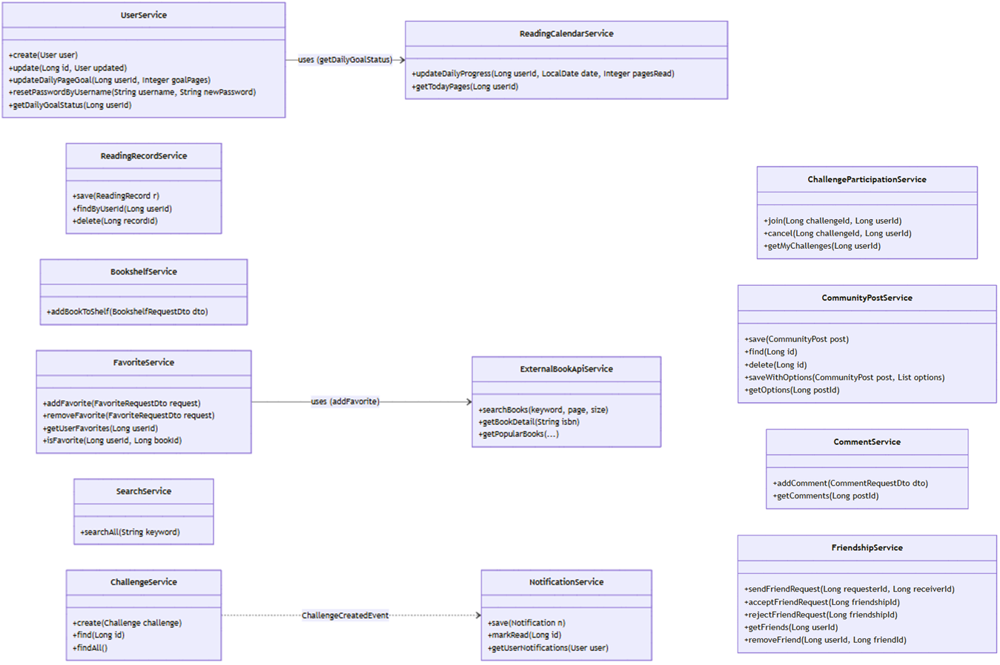

- UserService : 사용자 계정 관리, 프로필 업데이트, 비밀번호 초기화 및 일일 목표 상태 조회 등 핵심 계정 관련 비즈니스 트랜잭션을 처리

| 구분 | Name | Description | Dependency |
|:---|:---|:---|:---|
| Operations | create(User user) | 새로운 사용자 계정을 등록 | N/A |
|            | update(Long id, User updated) | 사용자 프로필 정보(닉네임, 소개, 이미지)를 업데이트 | N/A |
|            | updateDailyPageGoal(Long userId, Integer goalPages) | 사용자의 일일 목표 페이지를 갱신 | N/A |
|            | resetPasswordByUsername(String username, String newPassword) | 아이디로 사용자를 찾아 비밀번호를 재설정 | N/A |
|            | getDailyGoalStatus(Long userId) | 사용자의 일일 독서 목표 대비 달성 현황을 조회 | ReadingCalendarService |

- ReadingCalendarService : 일일 독서량 기록 및 조회 등 시간 기반 독서 활동 기록을 관리

| 구분 | Name | Description | Dependency |
|:---|:---|:---|:---|
| Operations | updateDailyProgress(Long userId, LocalDate date, Integer pagesRead) | 특정 날짜의 독서 페이지 수를 기록/갱신하고, 일일 목표 달성 여부를 판단하여 저장 | N/A |
|            | getTodayPages(Long userId) | 오늘 읽은 총 페이지 수를 조회 | N/A |

- ReadingRecordService : 개별 도서에 대한 상세 독서 기록(진행률, 리뷰, 평점 등)의 CRUD를 처리

| 구분 | Name | Description | Dependency |
|:---|:---|:---|:---|
| Operations | save(ReadingRecord r) | 독서 기록을 저장 | N/A |
|            | findByUserId(Long userId) | 특정 사용자의 모든 독서 기록 목록을 조회 | N/A |
|            | delete(Long recordId) | 독서 기록을 삭제 | N/A |

- BookshelfService : 사용자의 서재(읽고 싶은 책, 읽는 중, 완독 등)에 도서를 추가하고 관리하는 비즈니스 트랜잭션을 처리

| 구분 | Name | Description | Dependency |
|:---|:---|:---|:---|
| Operations | addBookToShelf(BookshelfRequestDto dto) | 사용자의 특정 타입 서재에 책을 추가하고, 진행률 상태를 계산하여 BookshelfBook 객체로 저장 | N/A |

- FavoriteService : 사용자의 도서 찜하기(Favorite) 기능을 관리. DB에 없는 책은 외부 API를 통해 정보를 가져와 저장 후 찜

| 구분 | Name | Description | Dependency |
|:---|:---|:---|:---|
| Operations | addFavorite(FavoriteRequestDto request) | 도서를 찜 목록에 추가 | ExternalBookApiService |
|            | removeFavorite(FavoriteRequestDto request) | 찜 목록에서 도서를 제거 | N/A |
|            | getUserFavorites(Long userId) | 특정 사용자의 전체 찜 목록을 조회 | N/A |
|            | isFavorite(Long userId, Long bookId) | 특정 도서를 찜했는지 여부를 확인 | N/A |

- ExternalBookApiService : 외부 도서 API를 호출하여 실시간 도서 정보(검색, 상세, 인기 도서)를 가져오는 역할을 담당합니다.

| 구분 | Name | Description | Dependency |
|:---|:---|:---|:---|
| Operations | searchBooks(keyword, page, size) | 키워드로 외부 도서 목록을 검색하여 DTO 형태로 반환 | N/A |
|            | getBookDetail(String isbn) | ISBN 기반으로 외부 API에서 도서 상세 정보를 조회 | N/A |
|            | getPopularBooks(...) | 기간, 연령 등 필터 기준으로 인기 도서 목록을 조회 | N/A |

- SearchService : 도서 DB 및 커뮤니티 게시글 DB 등 여러 소스를 통합하여 검색을 수행

| 구분 | Name | Description | Dependency |
|:---|:---|:---|:---|
| Operations | searchAll(String keyword) | 키워드를 이용해 로컬 DB의 도서와 커뮤니티 게시글을 통합 검색하여 반환 | N/A |

- ChallengeService : 챌린지 생성, 조회 등 챌린지 자체의 메타데이터를 관리. 챌린지 생성 시 이벤트 발행

| 구분 | Name | Description | Dependency |
|:---|:---|:---|:---|
| Operations | create(Challenge challenge) | 새로운 챌린지를 DB에 저장하고, 챌린지 생성 이벤트를 발행 | N/A |
|            | find(Long id) | 특정 챌린지 정보를 조회 | N/A |
|            | findAll() | 모든 챌린지 목록을 조회 | N/A |

- ChallengeParticipationService : 사용자와 챌린지 간의 참여/취소 관계를 관리하고, 참여 중인 챌린지 목록을 조회

| 구분 | Name | Description | Dependency |
|:---|:---|:---|:---|
| Operations | join(Long challengeId, Long userId) | 사용자를 특정 챌린지에 참여 | N/A |
|            | cancel(Long challengeId, Long userId) | 사용자의 특정 챌린지 참여를 취소 | N/A |
|            | getMyChallenges(Long userId) | 특정 사용자가 참여 중인 모든 챌린지 목록을 조회 | N/A |

- CommunityPostService : 게시글의 CRUD 및 게시글 옵션(투표 항목 등)을 함께 관리하는 핵심 커뮤니티 로직을 담당

| 구분 | Name | Description | Dependency |
|:---|:---|:---|:---|
| Operations | save(CommunityPost post) | 일반 게시글을 저장(CRUD 기본) | N/A |
|            | find(Long id) | 특정 게시글을 ID로 조회 | N/A |
|            | delete(Long id) | 특정 게시글을 삭제 | N/A |
|            | saveWithOptions(CommunityPost post, List<PostOption> options) | 게시글과 함께 투표/퀴즈 옵션 목록을 트랜잭션 단위로 저장 | N/A |
|            | getOptions(Long postId) | 특정 게시글에 연결된 옵션(투표 항목 등) 목록을 조회 | N/A |

- CommentService : 게시글에 대한 댓글 생성 및 조회 로직을 처리

| 구분 | Name | Description | Dependency |
|:---|:---|:---|:---|
| Operations | addComment(CommentRequestDto dto) | 게시글에 새로운 댓글을 작성하여 저장 | N/A |
|            | getComments(Long postId) | 특정 게시글에 달린 모든 댓글 목록을 조회 | N/A |

- FriendshipService : 사용자 간의 친구 요청, 수락, 거절, 삭제 등 모든 친구 관계 로직을 처리

| 구분 | Name | Description | Dependency |
|:---|:---|:---|:---|
| Operations | sendFriendRequest(Long requesterId, Long receiverId) | 다른 사용자에게 친구 요청 | N/A |
|            | acceptFriendRequest(Long friendshipId) | 친구 요청을 수락하고 관계 상태를 'ACCEPTED'로 변경 | N/A |
|            | rejectFriendRequest(Long friendshipId) | 친구 요청을 거절하고 관계 상태를 'REJECTED'로 변경 | N/A |
|            | getFriends(Long userId) | 특정 사용자의 수락된 친구 목록을 조회 | N/A |
|            | removeFriend(Long userId, Long friendId) | 친구 관계를 삭제 | N/A |

- NotificationService : 알림 생성, 읽음 처리, 사용자별 알림 목록 조회 등 알림 기록 관련 로직을 담당

| 구분 | Name | Description | Dependency |
|:---|:---|:---|:---|
| Operations | save(Notification n) | 새로운 알림을 저장 | N/A |
|            | markRead(Long id) | 특정 알림을 '읽음' 상태로 변경 | N/A |
|            | getUserNotifications(User user) | 특정 사용자의 최신 알림 목록을 조회 | N/A |

---

## 4. Sequence Diagram

이 장에서는 주요 기능들의 동적 상호작용을 시퀀스 다이어그램으로 표현한다.

### 4.1. 회원가입 시퀀스 다이어그램

사용자가 회원가입을 진행하는 과정을 나타내는 시퀀스 다이어그램이다.
사용자가 웹 페이지에서 회원가입 버튼을 클릭하면, 시스템은 회원가입을 위한 폼을 요청하고 화면에 표시한다. 사용자는 이름, 비밀번호, 닉네임, 이메일 등의 필수 정보를 입력하고, 웹 페이지는 입력된 정보를 백엔드 시스템으로 전달한다. 백엔드 시스템은 전달받은 정보를 바탕으로 사용자 정보의 유효성을 검증하고, 검증이 완료되면 데이터베이스에 새로운 사용자 정보를 저장한다. 이후 데이터베이스가 반환한 저장 결과를 확인하여 회원가입이 정상적으로 처리되었는지를 검증한 뒤, 시스템은 회원가입 완료 응답을 웹 페이지로 전송한다. 마지막으로 웹 페이지는 사용자에게 회원가입이 완료되었음을 알리고, 로그인을 진행할 수 있도록 안내 메시지를 표시하면서 회원가입 과정이 종료된다.

### 4.2. 로그인/로그아웃 시퀀스 다이어그램
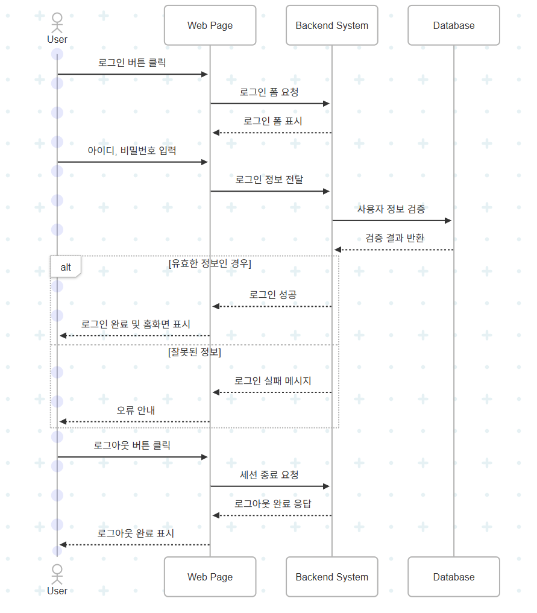

사용자가 로그인과 로그아웃 기능을 이용하는 과정을 나타내는 시퀀스 다이어그램이다.
사용자가 웹 페이지에서 로그인 버튼을 클릭하고 이메일과 비밀번호를 입력하면, 웹 페이지는 해당 정보를 백엔드 시스템으로 전달한다. 시스템은 데이터베이스를 조회하여 입력된 정보가 유효한지 검증하고, 검증이 완료되면 로그인 성공 응답과 함께 사용자 세션 또는 인증 토큰을 생성하여 웹 페이지로 전송한다.
웹 페이지는 사용자에게 로그인 성공 메시지를 표시하고, 사용자 전용 화면으로 이동시킴으로써 로그인 과정이 완료된다. 로그아웃 과정에서는, 로그인 상태의 사용자가 로그아웃 버튼을 클릭하면 웹 페이지가 로그아웃 요청을 백엔드 시스템으로 전달한다. 시스템은 해당 사용자의 세션이나 인증 토큰을 무효화하여 접근 권한을 해제하고, 로그아웃 완료 응답을 웹 페이지로 전송한다. 웹 페이지는 사용자에게 로그아웃이 완료되었음을 알리고, 초기 화면 또는 로그인 페이지로 이동시키면서 로그아웃 과정이 종료된다.

### 4.3. 독서 기록 작성 시퀀스 다이어그램

사용자가 독서 기록을 작성하는 과정을 나타내는 시퀀스 다이어그램이다. 사용자가 웹 페이지에서 독서 기록 작성 버튼을 클릭하면, 웹 페이지는 기록 입력 폼을 사용자에게 표시한다. 사용자는 읽은 책의 제목, 별점, 좋아하는 구절 등의 내용을 입력하고 저장을 요청한다. 웹 페이지는 입력된 데이터를 백엔드 시스템으로 전달하고, 시스템은 해당 정보를 데이터베이스에 저장한다. 데이터베이스가 저장 결과를 반환하면 시스템은 이를 확인하여 독서 기록이 정상적으로 등록되었는지 검증한다. 이후 시스템은 저장 성공 메시지를 웹 페이지로 전송하고, 웹 페이지는 사용자에게 “독서 기록이 성공적으로 작성되었습니다.”라는 안내 메시지를 표시하면서 독서 기록 작성 과정이 완료된다.

### 4.4. 도서 상세 조회 시퀀스 다이어그램
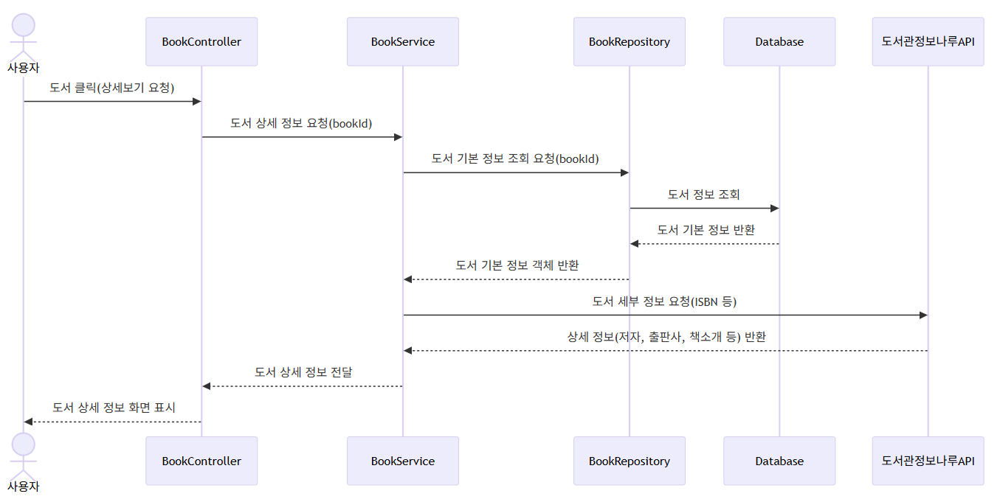

사용자가 도서 상세 조회하는 과정을 나타낸 sequence diagram이다. 사용자가 특정 도서를 클릭하면 시스템은 해당 도서의 상세 정보를 불러와 화면에 표시한다. 먼저 내부 데이터베이스에서 도서의 기본 정보(제목, 표지, ISBN 등)를 조회하고, 이후 도서관정보나루 API를 호출하여 저자, 출판사, 책 소개와 같은 세부 정보를 추가로 가져온다. 사용자의 도서 관련 상태(찜 여부, 독서 기록 여부 등)도 함께 조회하여 사용자에게 표시하며, 해당도서에 대한 다른 사용자들의 도서평도 함께 보여준다. 또한 사용자는 이 화면에서 찜하기, 독서 기록 작성, 구매 사이트 이동 등 도서 관련 기능을 직접 수행할 수 있다. 시스템은 사용자의 추가 요청이 발생할 경우, 해당 동작을 처리하고 결과를 즉시 반영함으로써 도서 상세 조회 과정을 완성한다.

### 4.5. 도서 검색 및 인기도서 조회 시퀀스 다이어그램
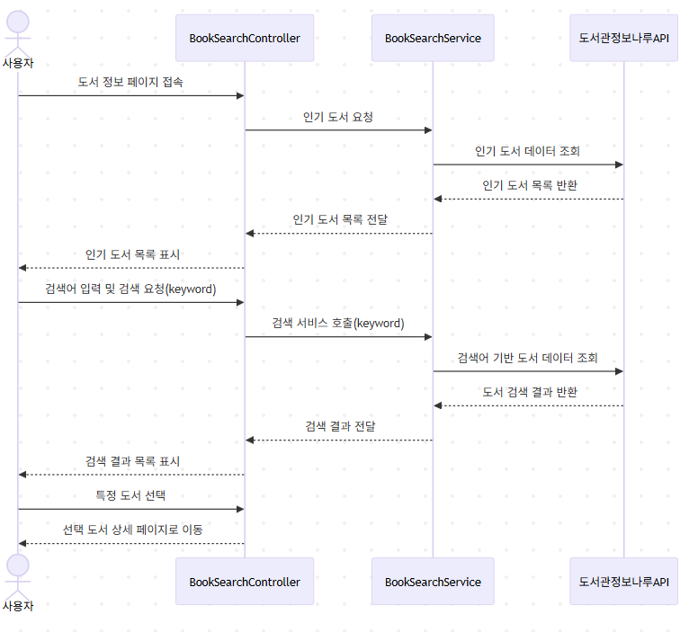

사용자가 도서 검색 기능을 사용하는 과정을 나타낸 sequence diagram이다. 사용자가 도서 정보 페이지로 이동하면 시스템은 도서관정보나루 API와 연동하여 인기 도서 목록을 먼저 조회해 화면에 표시한다. 이후 사용자가 검색창에 도서명이나 저자명 등의 키워드를 입력해 검색 요청을 보내면, 시스템은 입력된 검색어를 기반으로 도서관정보나루 API에 도서 데이터를 조회하고, 검색 결과 목록을 사용자에게 반환한다. 사용자는 검색 결과에서 원하는 도서를 선택할 수 있으며, 선택 즉시 해당 도서의 상세 정보 페이지로 이동하여 더 자세한 정보를 확인할 수 있다. 이렇게 시스템은 실시간 API 연동을 통해 최신 도서 검색 기능을 제공한다.

### 4.6. 챌린지 생성 시퀀스 다이어그램

사용자가 챌린지 생성을 하는 과정을 나타내는 sequence diagram이다. 사용자가 챌린지 생성 버튼으로 새로운 챌린지에 대한 내용을 작성한 후 챌린지 만들기를 하면, 시스템은 먼저 전달받은 정보를 바탕으로 새로운 챌린지를 등록하기 위한 내부 처리를 수행한 뒤, 데이터베이스에 챌린지 정보를 저장한다. 시스템은 데이터베이스가 반환하는 정보를 확인하여 챌린지가 정상적으로 등록되었는지 검증한다. 이후 시스템은 챌린지가 성공적으로 생성되었다는 사실을 사용자에게 알려주기 위해 알림 데이터를 저장하고, 사용자에게 챌린지 성공 메시지를 화면에 표시하도록 하여 챌린지 생성 과정이 종료된다.

### 4.7. 챌린지 참여 시퀀스 다이어그램
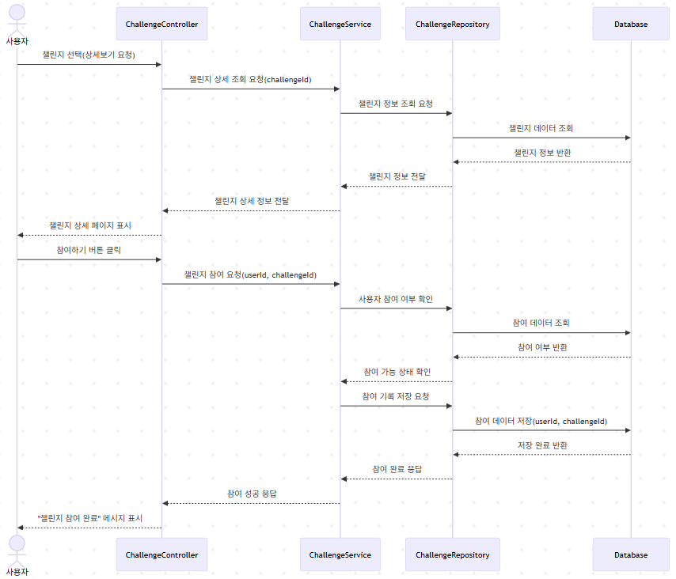

사용자가 독서 챌린지에 참여하는 과정을 나타내는 sequence diagram이다. 사용자는 화면에 표시된 챌린지 목록 중에서 참여 희망 챌린지를 선택하면, 시스템은 챌린지 상세 내용을 조회하고, 데이터베이스에서 세부 정보를 불러와 사용자게에 보여준다. 이후 사용자가 참여하기 버튼을 클릭하면, 시스템은사용자를 새로운 챌린지 참여자로 등록하고, 이때 데이터베이스에 사용자 id와 챌린지 id를 함께 저장하여 참여 이력이 기록되며, 등록이 완료되면 사용자에게 성공 메시지를 표시한다.

### 4.8. 랭킹 조회 시퀀스 다이어그램
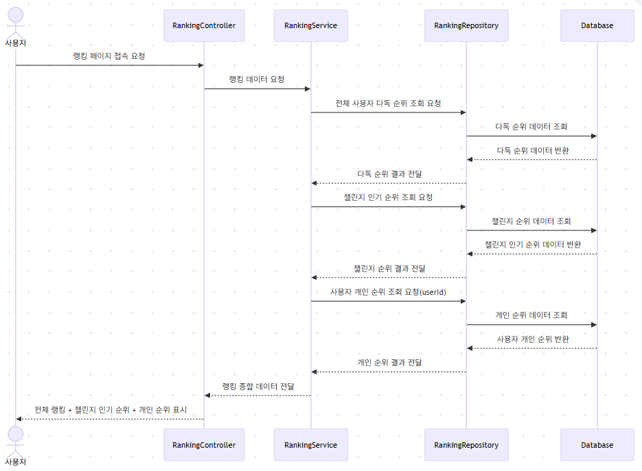

사용자가 서비스 내 랭킹을 조회하는 과정을 나타내는 sequence diagram이다. 사용자가 랭킹 페이지로 이동하면 시스템은 전체 서비스 내의 다독 순위, 챌린지 인기 순위, 그리고 사용자의 개인 다독 순위를 조회한다. 이를 위해 시스템은 데이터베이스에서 관련 정보를 조회하여 종합한 뒤 사용자에게 화면으로 표시한다. 사용자는 자신의 순위를 포함한 다양한 랭킹 정보를 한눈에 확인할 수 있다.

### 4.9. 게시글 작성 시퀀스 다이어그램
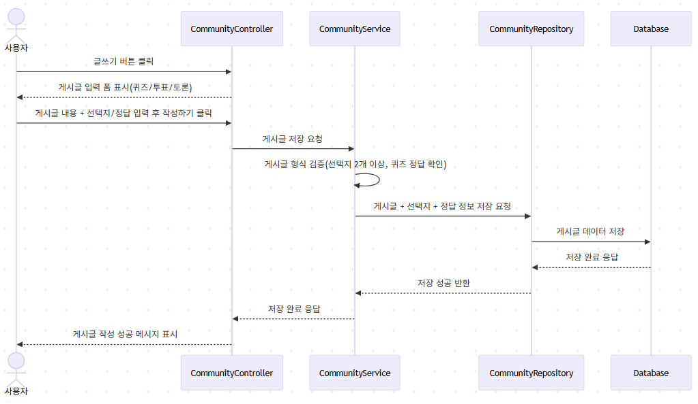

사용자가 커뮤니티 게시글을 작성하는 과정을 나타내는 sequence diagram이다. 사용자가 커뮤니티 화면에서 글쓰기 버튼을 클릭하면 시스템은 작성 유형(퀴즈/투표/토론)에 맞는 입력 폼을 제공한다. 퀴즈 또는 투표일 경우 최소 2개 이상의 선택지를 입력해야 하며, 퀴즈이면 정답 입력 또한 필수이다. 사용자가 작성하기 버튼을 누르면 시스템은  입력된 데이터의 유효성을 검증하고,  게시글과 선택지 정보를 데이터베이스에 저장한다.  저장이 완료되면 시스템은 사용자에게 게시글 작성 성공 메시지를 표시하며 커뮤니티 목록에서 확인할 수 있다.

### 4.10. 프로필 설정 시퀀스 다이어그램
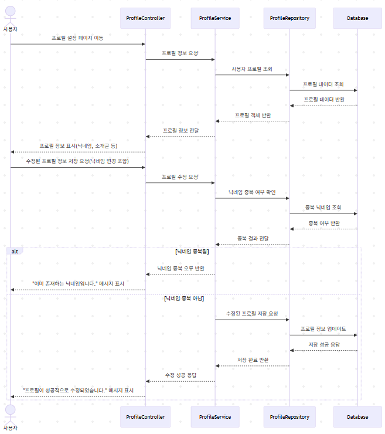

사용자가 자신의 프로필을 설정하는 과정을 나타내는 sequence diagram이다. 사용자가 마이페이지에서 프로필 설정 화면으로 이동하면 시스템은 데이터베이스에서 닉네임과 소개글 등의 기본 정보를 불러와 화면에 표시한다. 사용자가 닉네임을 수정하려는 경우, 시스템은 먼저 해당 닉네임이 다른 사용자와 중복되는지 검사한다. 만약 이미 존재하는 닉네임이라면 시스템은 오류 메시지를 출력하고 사용자가 다시 입력하도록 안내한다. 중복되지 않는 닉네임일 경우에만 수정된 프로필 정보를 데이터베이스에 저장될 수 있다. 사용자가 저장 버튼을 눌렀을 때 시스템은  변경된 정보를 정상적으로 반영하고 성공 메시지를 표시한다. 저장이 완료되면 사용자는 업데이트된 최신 프로필 정보를 화면에서 즉시 확인할 수 있다.

### 4.11. 친구 추가 시퀀스 다이어그램
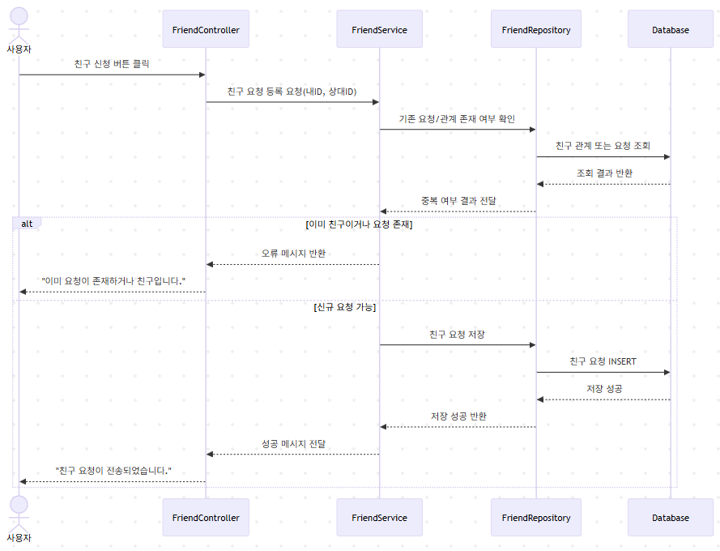

사용자가 다른 사용자에게 친구 신청을 보내는 과정을 나타낸 sequence diagram이다. 사용자가 특정 프로필 화면에서 친구 신청 버튼을 클릭하면, 시스템은 요청을 처리하기 위해 기존에 친구 관계가 있거나 이미 요청이 존재하는지 먼저 검사한다. 이미 친구이거나 친구 요청이 존재한다면 시스템은 오류 메시지를 출력하여 중복 요청을 차단한다. 
중복이 없다면 시스템은 데이터베이스에 새 친구 요청 정보를 저장하고, 사용자에게 “친구 요청이 전송되었습니다.”라는 메시지를 표시한다. 이 과정을 통해 사용자는 올바르게 친구 요청을 보낼 수 있으며, 시스템은 중복 요청이나 잘못된 요청을 방지한다.

### 4.12. 도서 찜하기(토글 방식) 시퀀스 다이어그램

이 다이어그램은 하나의 버튼으로 두 가지 상태(추가/해제)를 번갈아 처리하는 토글 로직을 보여준다.  

⦁ **핵심 로직**: 서버가 현재 상태를 먼저 확인하고 그에 따라 반대 행동을 한다.
 1. 사용자가 '찜' 아이콘을 누르면, 클라이언트는 서버에 POST 요청을 보낸다.
 2. 서버(WishlistService)는 데이터베이스에서 이 사용자가 이 책을 이미 찜했는지 먼저 확인(Select)한다.
 3. alt (대안) 블록이 여기서 나뉜다.  
 \- 만약 이미 찜한 상태(true)라면: 찜 목록에서 해당 데이터를 삭제(Delete)하고 "removed"라고 응답한다.  
 \- 만약 찜하지 않은 상태(false)라면: 찜 목록에 새 데이터를 생성(Create)하고 "added"라고 응답한다.  
 4. 클라이언트는 서버의 응답("added" 또는 "removed")에 따라 하트 아이콘을 채우거나 비운다.

### 4.13. 목표 설정 시퀀스 다이어그램

이 다이어그램은 데이터가 없으면 새로 만들고, 있으면 수정하는 'Upsert' 로직을 보여준다.

⦁ **핵심 로직**: 서버가 기존 데이터 유무를 확인하여 생성(Create)할지 수정(Update)할지 결정한다.  
 1. 사용자가 "월 5권 읽기" 같은 목표를 설정하고 저장한다.  
 2. 서버(GoalService)는 데이터베이스에서 이 사용자의 이달(goalType) 목표가 이미 존재하는지 먼저 확인(Select)한다.  
 3. alt (대안) 블록이 나뉜다.  
 \- 만약 기존 목표가 없다면(false): 새로운 독서 목표(ReadingGoal) 데이터를 생성(Create)한다.  
 \- 만약 기존 목표가 있다면(true): 기존 데이터를 수정(Update)한다. (예: 5권을 7권으로 변경)  
 4. 서버는 "저장 완료" 응답을 보내고, 클라이언트는 UI에 "저장됨"을 표시한다.

### 4.14. 알림 시퀀스 다이어그램
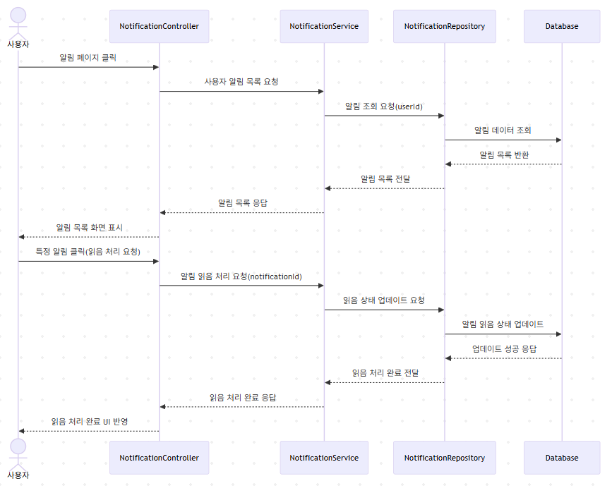

사용자가 서비스에서 제공하는 알림을 조회하고 읽음 처리하는 과정을 나타낸 sequence diagram이다. 사용자가 화면 상단의 알림 버튼을 클릭하면 시스템은 데이터베이스에서 해당 사용자에게 전달된 친구 요청, 댓글 알림, 챌린지 관련 알림 등 모든 알림 목록을 조회하여 화면에 표시한다. 사용자가 특정 알림을 클릭하여 읽음 처리를 요청하면, 시스템은 해당 알림의 읽음 상태를 데이터베이스에서 업데이트하고, UI에 즉시 반영하여 사용자가 해당 알림이 읽힌 것으로 확인하도록 한다.

---

## 5. State Machine Diagram

1. 로그인 및 인증 단계

사용자가 Starbooks 서비스를 이용하기 위해서는 먼저 로그인 절차를 거쳐야 한다. 로그인 시도 시 시스템은 데이터베이스에서 사용자 계정 정보를 확인하며, 비밀번호 검증을 진행한다. 인증이 성공하면 사용자는 Starbooks의 홈 화면으로 진입한다. 만약 인증이 실패할 경우 로그인 화면에 머무르게 되며, 사용자는 회원가입을 통해 새로운 계정을 생성하거나 기존 계정 정보를 수정한 뒤 다시 로그인할 수 있다.

2. 홈 화면 및 주요 메뉴 탐색

로그인 후 표시되는 홈 화면은 Starbooks의 모든 기능에 접근할 수 있는 핵심 출발점이다. 사용자는 홈 화면에서 내 서재 페이지, 도서 정보 페이지, 인기 도서 목록, 챌린지 페이지, 랭킹 페이지, 커뮤니티 페이지, 알림 페이지, 마이페이지(프로필, 친구 목록)과 같은 기능 메뉴로 이동할 수 있다. 

3. 목표 설정 기능

사용자가 매일 읽을 목표를 설정할 수 있는 기능이다. 내 서재 페이지에 진입하여 목표 설정을 통해 목표 페이지를 설정하면 일일 목표 페이지가 설정되고 오늘 읽은 페이지를 계속적으로 추가하는 것으로 일일 목표에 달성률을 시각적으로 확인할 수 있다. 독서 캘린더에 달성 여부를 표시하여 업데이트된다. 이 기능은 사용자 동기부여를 위해 매일 수행할 수 있으며, 독서 캘린더에 자신의 달성 현황을 확인할 수 있다.

4. 도서 검색 및 상세 정보 조회 기능

사용자는 도서 정보 페이지에서 검색창에 키워드를 입력하여 원하는 도서를 찾을 수 있다. 검색은 도서관정보나루 API를 통해 이루어지며, 검색 결과는 사용자의 입력어와 일치하는 도서 목록으로 구성된다. 인기 도서 조회 기능도 동일한 외부 API를 통해 제공된다. 사용자가 도서를 선택하면 도서 상세 화면에서 제목, 저자, 출판사, 책 소개 정보를 확인할 수 있다. 상세 화면에서는 도서 찜하기, 도서 목록에 추가, 독서 기록 작성, 구매 사이트 이동, 독서 기록 조회 등의 기능을 수행할 수 있다.

5. 챌린지 기능

챌린지 메뉴에서는 사용자들이 공동의 목표를 가지고 자유롭게 참여할 수 있는 독서 습관 형성을 위한 다양한 챌린지가 제공된다. 사용자는 원하는 챌린지를 선택하여 참여하거나, 참여 중인 챌린지를 취소할 수 있다. 시스템은 데이터베이스에서 챌린지 상세 정보를 조회하여 사용자에게 제공한다. 참여 시 사용자 ID와 챌린지 ID가 매핑되어 참여 이력이 기록된다.

6. 랭킹 기능

랭킹 페이지에서는 전체 사용자 다독 순위, 챌린지 인기 순위, 자신의 다독 순위와 같은 순위를 확인할 수 있다. 시스템은 최신 랭킹 데이터를 조회하여 화면에 표시하며, 사용자는 실시간으로 변화된 순위를 확인할 수 있다.

7. 커뮤니티 기능

커뮤니티 페이지에서는 사용자가 글을 작성하거나 다른 사용자들의 게시글을 확인할 수 있다. 글쓰기 버튼을 통해 게시글 작성 화면으로 이동할 수 있으며, 투표/퀴즈/토론의 폼을 선택하여 작성할 수 있다. 투표 또는 퀴즈의 경우 선택지 입력(최소 2개)의 조건과 퀴즈일 때는 정답 입력 필수 조건이 더 붙는다. 게시글 저장 및 삭제 기능 제공하며, 게시글 상세 화면에서 댓글 작성이 가능하다. 커뮤니티는 Starbooks 내에서 하나의 도서에 대한 투표/퀴즈/토론을 통한 사용자 간 소통을 담당하는 공간이다.

8. 알림 기능

알림 페이지에서는 챌린지 관련 알림,  친구 신청 알림, 댓글 알림 같은 알림이 제공된다. 사용자는 알림 목록을 확인하고, 특정 알림을 클릭하여 읽음 처리할 수 있다.

9. 마이페이지 기능

마이페이지는 사용자의 개인 설정 기능을 모아둔 핵심 화면이다. 프로필 설정과 친구 목록으로 나뉜다. 닉네임, 소개글 등의 정보 확인 및 수정 가능하며 닉네임 중복 검사를 통해 자신의 프로필을 설정할 수 있다. 친구 목록 기능에는 현재 친구 목록과 친구 요청 대기 목록을 확인할 수 있으며, 친구 검색 기능을 통해 다른 사용자 닉네임 검색함으로써 친구 신청 및 요청 수락/거절이 가능하다. 수락 시 양쪽 사용자 계정에 친구 관계가 생성된다.

10. 로그아웃 및 종료

사용자가 모든 기능 사용을 마치면 로그아웃할 수 있으며, 로그아웃 시 시스템은 사용자 세션을 종료하고 로그인(인트로) 화면으로 돌아간다.

---

## 6. User Interface Prototype
이 장은 예상 UI와 UI 안의 각 구성요소를 설명한다. 실제 개발에 따라서 UI 디자인 및 일부 구성은 달라질 수 있지만 내용 및 기능은 동일하다.

### 6.1. 로그인

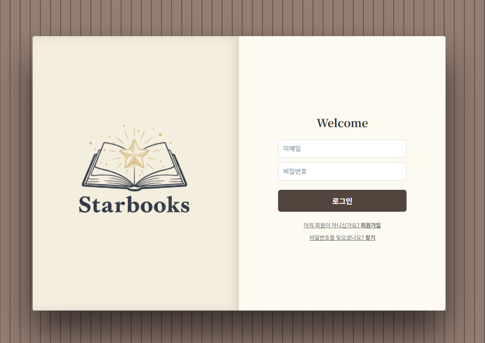

이메일과 비밀번호로 로그인을 진행할 수 있다. 

### 6.2. 회원가입

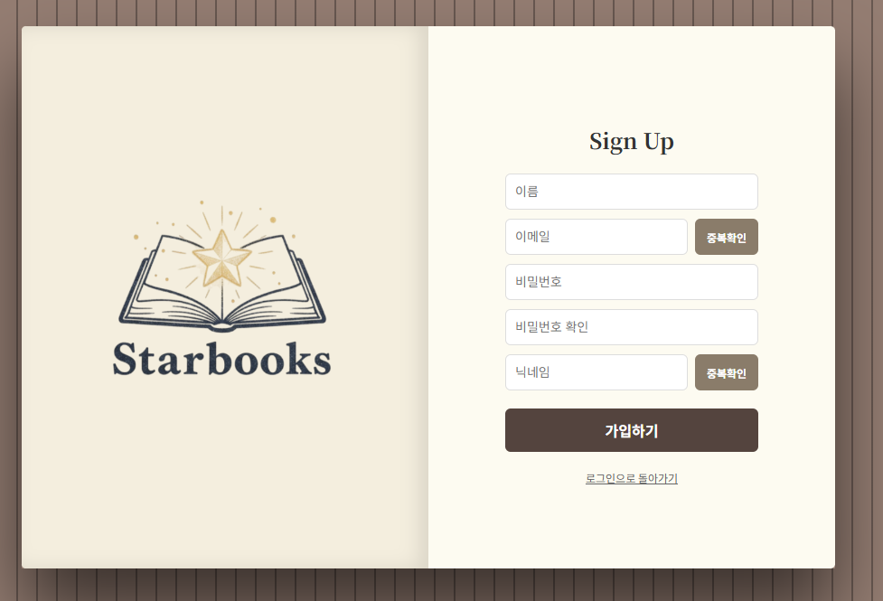

이름, 이메일, 비밀번호, 비밀번호 확인, 닉네임을 입력하여 회원가입을 진행할 수 있다. 이메일과 닉네임은 중복 확인을 해야 한다. Starbooks는 로그인을 해야 모든 기능에 접근할 수 있는 회원 전용 서비스이므로, 반드시 거쳐야 하는 절차다.

### 6.3. 헤더

헤더는 홈(로고), 내 서재, 도서 정보, 챌린지 및 랭킹, 커뮤니티로 구성되고, 헤더 상단에는 로그아웃, 마이페이지, 알림, 통합검색이 위치한다. 각 메뉴를 클릭하면 해당 페이지로 이동한다. 또한, 헤더 아래에는 현재 페이지를 안내하는 PageLocation 영역이 포함된다.

### 6.4. 홈

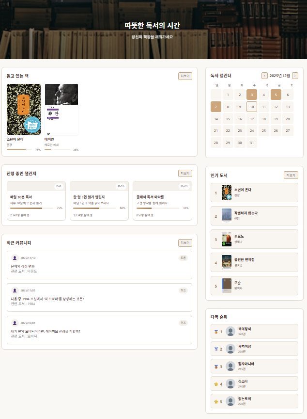

Starbooks가 제공하는 기능들을 엿볼 수 있는 홈 화면이다. 홈 화면에는 내 서재의 읽고 있는 책, 독서 캘린더, 인기 도서, 진행중인 챌린지, 최근 커뮤니티, 다독 순위를 확인할 수 있다. 더보기를 통해 관련 페이지로 이동될 수 있다.

### 6.5. 내 서재 화면

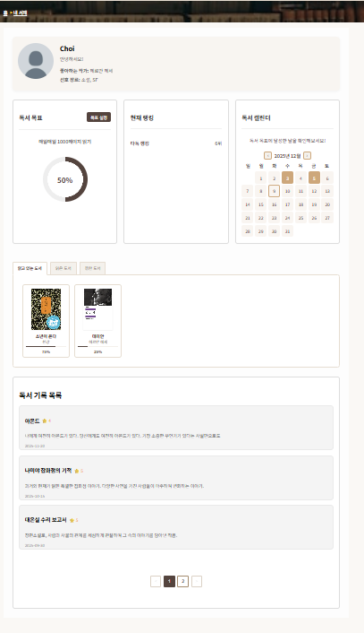

헤더의 내 서재를 통해 이동할 수 있는 화면이다. 화면에서는 나의 프로필, 독서 목표, 현재 랭킹, 독서 캘린더, 도서 목록, 독서 기록 목록을 확인할 수 있다.
독서 목표는 '목표 설정' 버튼을 통해 나타나는 모달 화면에서 일일 목표를 설정하고, 오늘 읽은 페이지를 추가하면 오늘의 목표 진행률을 원그래프로 시각적으로 확인할 수 있다. 독서 목표를 100% 달성한 날은 독서 캘린더에 달성일로 표시된다.
현재 랭킹은 자신의 다독 순위를 확인할 수 있는 부분이다.
도서 목록은 읽고 있는 도서, 읽은 도서, 찜한 도서 카테고리로 나뉘며, 읽고 있는 도서에는 진행률도 함께 표시된다. 각 도서를 클릭하면 도서 상세 페이지로 이동할 수 있다.
독서 기록 목록은 자신이 작성한 독서 기록을 보여주는 부분이다.
  
### 6.6. 도서 상세 화면

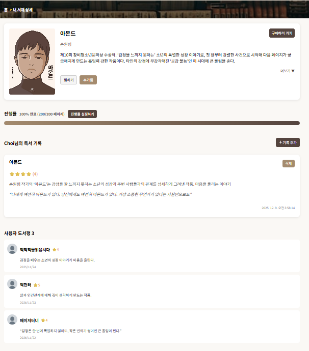

내 서재의 도서 목록에서 이동할 수 있는 화면이다. 화면에서는 해당 도서의 표지, 제목, 작가, 책 소개 정보를 제공한다.
'찜하기'와 '추가하기' 버튼을 통해 도서를 내 서재의 카테고리별로 추가할 수 있다. '구매하러 가기' 버튼을 통해 원하는 온라인 서점을 선택하면, 해당 도서 검색 페이지로 이동해 도서를 구매할 수 있다.
진행률은 '진행률 설정하기' 버튼으로 나타나는 모달 화면에서 전체 페이지와 현재 페이지를 입력해 설정할 수 있다.
독서 기록은 '기록 추가' 버튼을 통해 새로 추가할 수 있으며, 작성한 기록은 화면 아래에 나타난다.
사용자 도서평은 다른 사용자가 해당 도서에 남긴 도서평을 확인할 수 있는 영역이다.
도서 검색을 통해 도서 상세 화면으로 이동하면, 진행률과 독서 기록 부분은 표시되지 않는다.

### 6.7. 도서 정보 및 인기 도서 목록

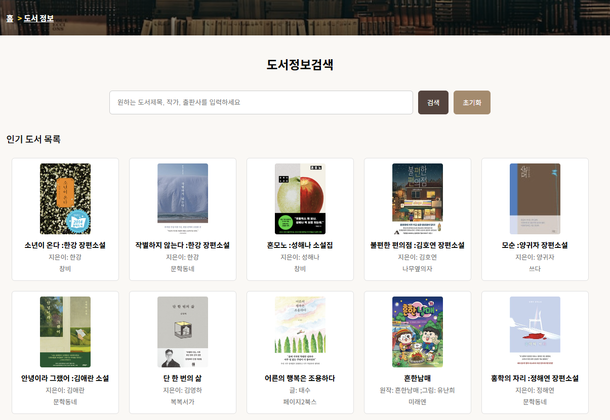

헤더의 도서 정보를 통해 이동할 수 있는 화면이다. 화면에 들어가면 인기 도서 목록이 바로 불러와지고, 각 도서를 클릭하면 도서 상세 화면으로 이동한다.
검색창에 키워드를 입력해 도서를 검색할 수 있으며, 검색 결과의 도서를 클릭해도 도서 상세 화면으로 이동할 수 있다.
도서 정보는 도서관 정보 나루 API를 통해 받아온 데이터를 보여준다.

### 6.8. 챌린지 목록

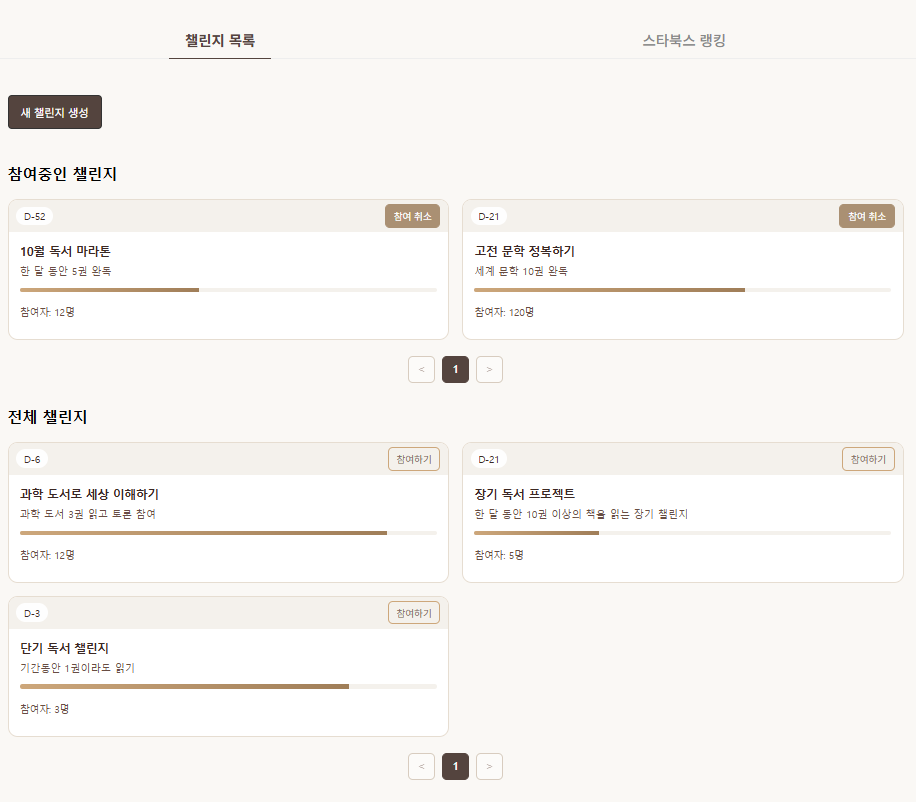

헤더의 챌린지-랭킹을 통해 이동할 수 있는 화면이다. 챌린지 목록 탭에서는 자신이 참여 중인 챌린지와 전체 챌린지를 확인할 수 있다.
'새 챌린지 생성' 버튼을 통해 새로운 챌린지를 만들 수 있으며, '참여하기' 버튼으로 챌린지에 참여하고, '참여 취소' 버튼으로 참여를 취소할 수 있다.
각 챌린지 카드를 클릭하면 해당 챌린지의 상세 정보를 모달 화면으로 확인할 수 있다. 상세 화면에서는 챌린지 제목, 내용, 목표 권수, 시작일과 마감일을 볼 수 있으며, 참여하기 버튼도 제공된다.

### 6.9. 챌린지 생성

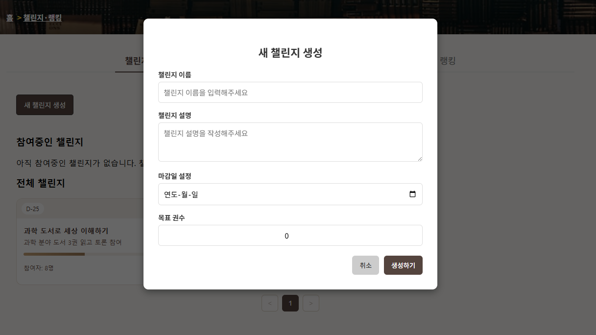

챌린지 목록에서 '새 챌린지 생성' 버튼을 누르면 나타나는 화면이다. 챌린지 이름과 설명, 마감일, 목표 권수를 설정해 챌린지를 생성할 수 있다. 마감일은 달력 아이콘을 통해 오늘 이후의 날짜를 선택하면 되며, '취소' 버튼으로 모달 화면을 닫을 수 있다.

### 6.10. 랭킹

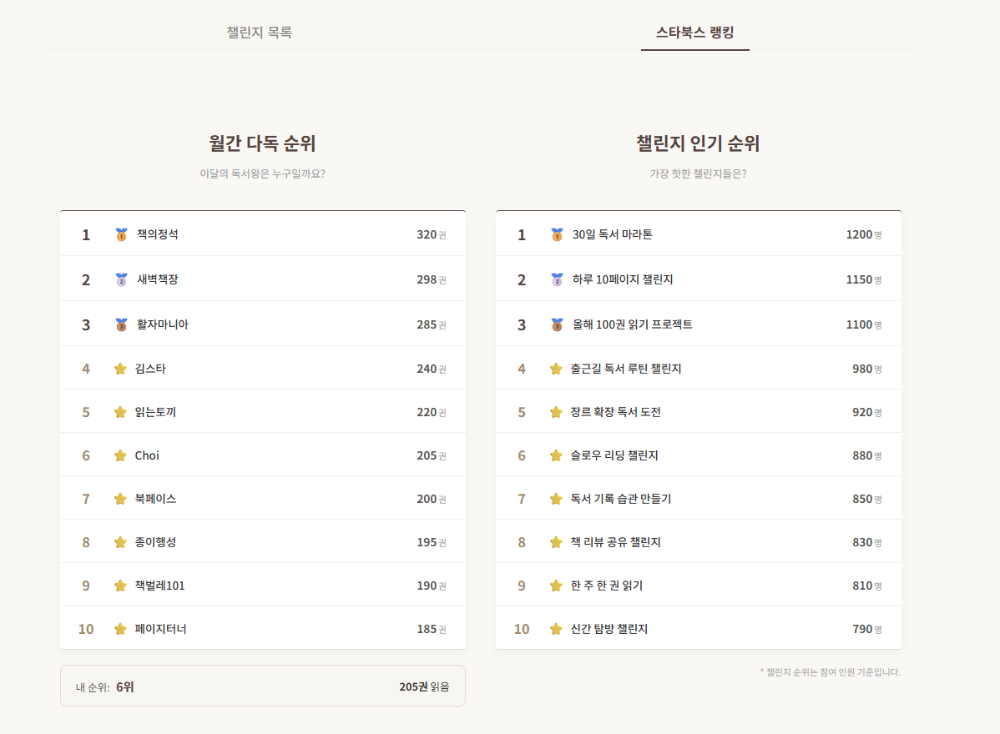

헤더의 챌린지-랭킹을 통해 이동할 수 있는 화면이다. 스타북스 랭킹 탭에서는 월간 다독 순위와 챌린지 인기 순위를 제공한다.
월간 다독 순위는 읽은 도서가 많은 사용자 순으로 매겨지고, 챌린지 인기 순위는 참여자가 많은 순으로 챌린지를 보여주어 사용자의 흥미를 높인다.
또한, 월간 다독 순위 아래에는 현재 자신의 순위를 표시해 자신의 위치를 쉽게 확인할 수 있다.

### 6.11. 커뮤니티 화면

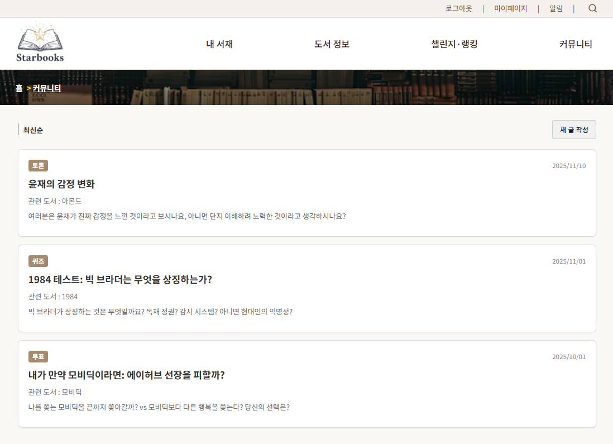

헤더의 커뮤니티를 통해 이동할 수 있는 화면이다. 커뮤니티 글 목록은 최신순으로 나열되며, 각 글이 토론, 퀴즈, 투표 중 어떤 형식인지 확인할 수 있다. '새 글 작성' 버튼을 통해 글을 작성할 수 있으며, 작성된 글의 제목, 관련 도서, 내용, 작성일자가 하나의 카드에 표시된다.
각 글 카드를 클릭하면 커뮤니티 상세 화면으로 이동한다.

### 6.12. 커뮤니티 작성

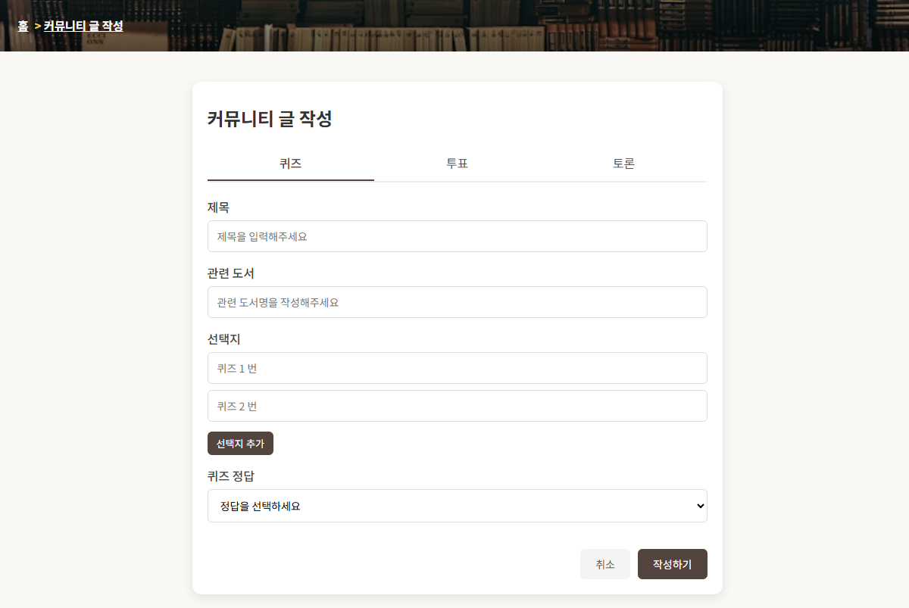

커뮤니티에서 '새 글 작성' 버튼을 통해 이동되는 화면이다. 글의 형식을 퀴즈, 투표, 토론 중에 선택하여 작성할 수 있다. 퀴즈 형식이면 제목, 관련도서, 선택지, 퀴즈정답을 입력받으며, 투표 형식이면 제목, 관련도서, 선택지를 입력받는다. 퀴즈와 투표의 선택지는 2~5개까지 가능하다. 토론 형식이면 제목, 관련 도서, 토론 내용을 입력받는다.

### 6.13. 커뮤니티 상세

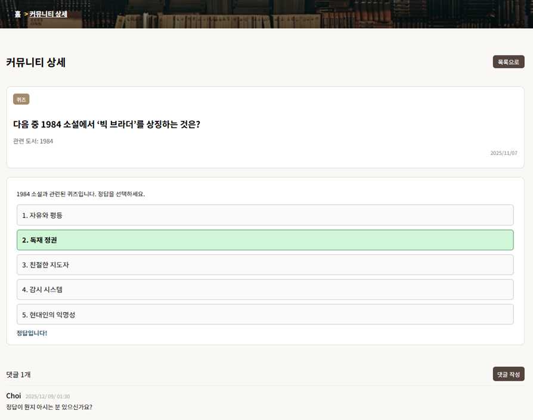

커뮤니티 화면에서 하나의 목록을 클릭하면 이동되는 커뮤니티 상세 화면이다. 화면에서는 글의 형식, 제목, 관련 도서, 작성일자를 확인할 수 있다. 글의 형식에 따라 아래 표시되는 내용이 달라진다. 퀴즈일 경우, 선택지를 선택하면 정답일 때는 '정답' 메시지를, 오답일 때는 선택한 선택지와 실제 정답을 보여준다. 투표일 경우, 선택지를 선택할 수 있으며, 토론일 경우 내용이 나타난다. 아래에는 댓글 목록이 표시되며, '댓글 작성' 버튼을 통해 나타나는 입력 필드에서 댓글을 작성할 수 있다. '목록으로' 버튼을 누르면 커뮤니티 목록 화면으로 돌아간다.

### 6.14. 프로필 설정

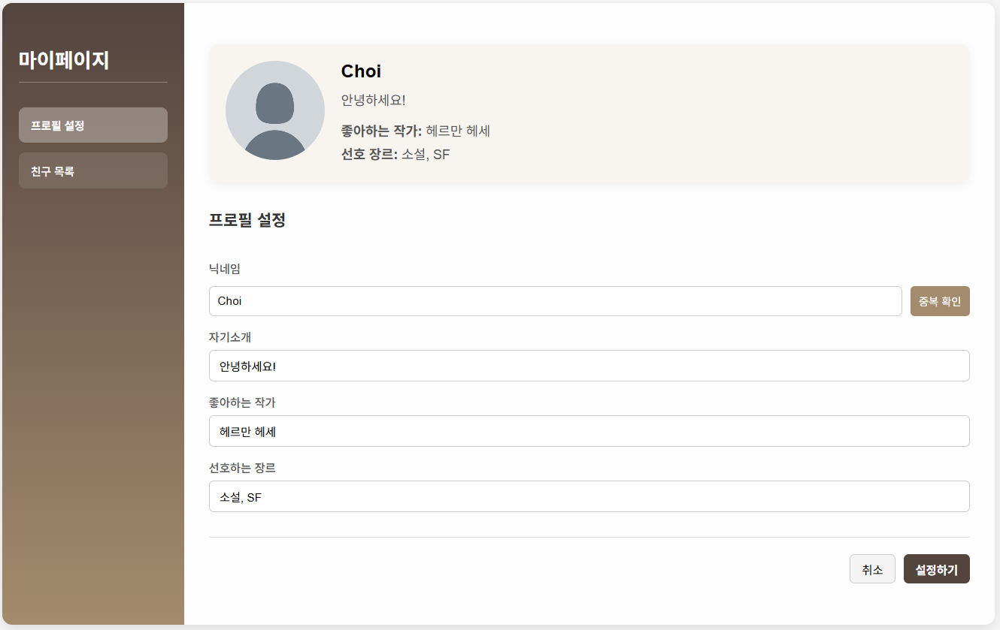

헤더의 마이페이지를 통해 이동할 수 있는 페이지다. 현재 설정된 프로필 내용을 불러와 수정할 수 있으며, 상단에서 현재 프로필을 확인할 수 있다.
닉네임은 '중복 확인' 버튼으로 중복 여부를 확인한 뒤 수정할 수 있다.

### 6.15. 친구 목록

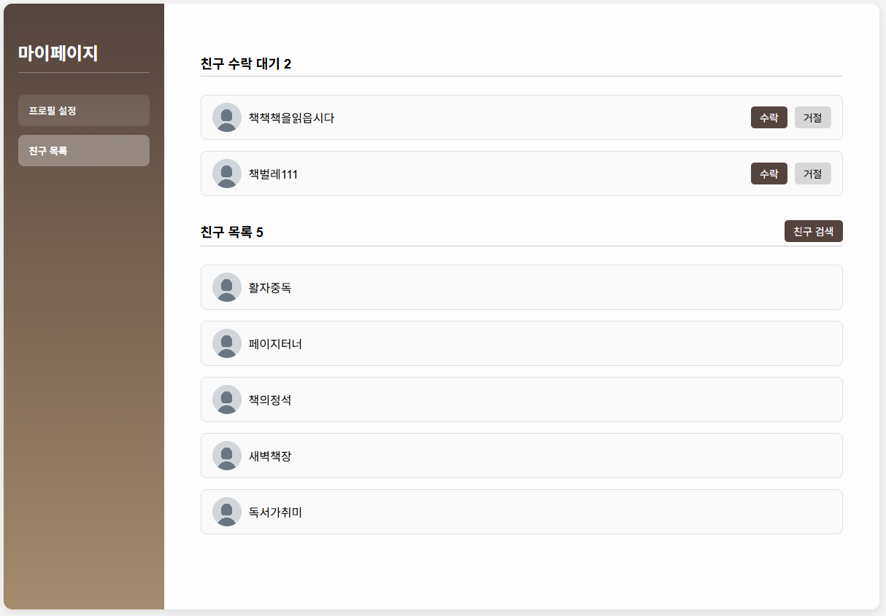

마이페이지의 친구 목록을 통해 확인할 수 있는 페이지다. 친구 수락 대기 목록과 친구 목록이 있으며, 각 목록을 클릭하면 해당 사용자의 서재를 볼 수 있다. '수락'과 '거절' 버튼으로 친구 요청을 처리할 수 있으며, '친구 검색' 버튼을 누르면 나타나는 모달에서 친구 닉네임를 검색하고 나타난 결과를 클릭하면 해당 친구의 서재로 이동하여 친구 신청을 할 수 있다.

### 6.16. 서재 구경

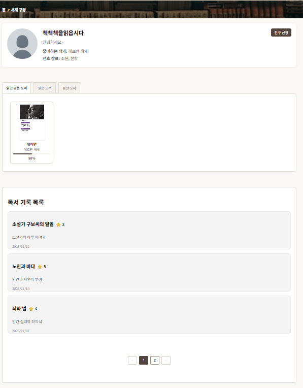

친구 목록 또는 친구 검색을 통해 이동할 수 있는 화면이다. 화면에서는 친구의 프로필, 도서 목록, 독서 기록 목록을 확인할 수 있으며, '친구 신청' 버튼으로 친구 요청을 보낼 수 있다.

### 6.17. 알림

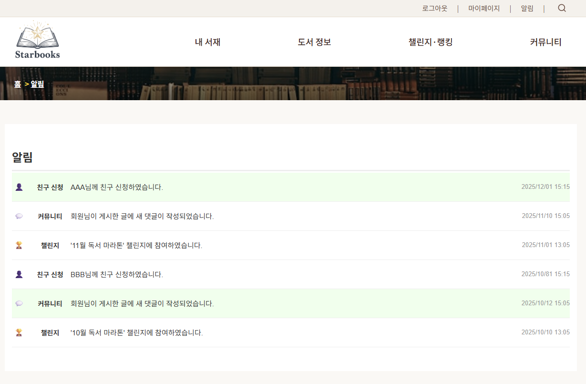

헤더의 알림 버튼을 통해 이동할 수 있는 화면이다. 사용자가 챌린지를 생성하거나, 자신이 작성한 글에 댓글이 달리거나, 다른 사용자에게 친구 신청을 요청하면 알림으로 표시된다. 각 알림 목록을 클릭하면 읽음 처리를 할 수 있으며, 새 알림은 초록 배경, 읽은 알림은 흰색 배경으로 표시된다.

### 6.18. 통합검색

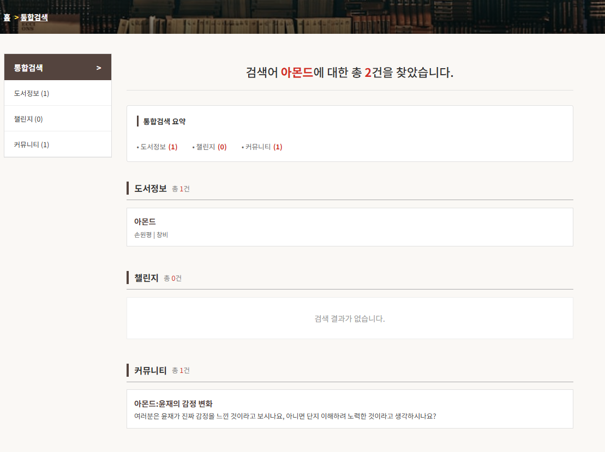

헤더의 돋보기 버튼을 통해 키워드를 입력하고 엔터를 누르면 이동하는 통합검색 화면이다. 검색 결과는 도서 정보, 챌린지, 커뮤니티 카테고리로 나뉘며, 각 카테고리에서 관련 페이지로 이동할 수 있다. 검색 결과가 없으면 "검색 결과가 없습니다."라는 메시지를 표시한다.

---

## 7. Implementation Requirements

H/W platform requirements 

- CPU: Intel i3 이상
- RAM: 8GB RAM 이상
- HDD / SSD: 500GB SSD 이상
- Network: WAN 연결 가능 (TCP/IP 지원)

Server Platform Requirements

Application Server:
- AWS EC2 t2.micro 이상
- OS: Ubuntu 20.04 LTS
- CPU: 1 vCPU
- RAM: 1GB 이상
- Storage: 30GB 이상

Database Server:
- AWS RDS MySQL db.t2.micro 이상
- CPU: 1 vCPU
- RAM: 1GB 이상
- Storage: 20GB 이상

S/W platform requirements

Backend :
- OS: Windows 10 이상
- Implement Language: Java 11+
- Framework: Spring Boot 2.6+
- Database: MySQL 8+

Front-end: 
- OS: Windows 10 이상
- Implement Language: JavaScript(ES6+), HTML5, CSS3
- Framework / Libraries: React 18+
- Development Environment / IDE: Visual Studio Code 1.80+
- Package Manager / Build Tool: Node.js 18+, npm 9+
- Browser Compatibility: Chrome 90+, Firefox 88+, Safari 14+

---

## 8. Glossary

| 용어 | 설명 |
|:---|:---|
| 독서 기록 | 사용자가 읽은 책에 대한 별점, 도서평, 구절 등의 기록 |
| 챌린지 | 사용자가 공동 목표를 설정하고 정해진 기간 동안 함께 독서하는 활동. 다른 사용자들이 자유롭게 참여할 수 있음 |
| 내 서재 | 사용자가 개인 도서를 관리하는 공간으로, 읽은 도서, 읽고 있는 도서, 찜한 도서로 구분됨 |
| 찜하기 | 관심 있는 도서를 개인 목록에 저장하는 기능 |
| 커뮤니티 | 퀴즈, 토론, 투표 등의 형식을 활용해 특정 책에 대해 자유롭게 의견을 나눌 수 있는 공간 |

---

## 9. References

1. Software Engineering: A Practitioner's Approach, Roger S. Pressman
2. UML Distilled: A Brief Guide to the Standard Object Modeling Language, Martin Fowler
3. Spring Boot Reference Documentation
4. React Documentation
5. MySQL Documentation
6. RESTful Web Services, Leonard Richardson
